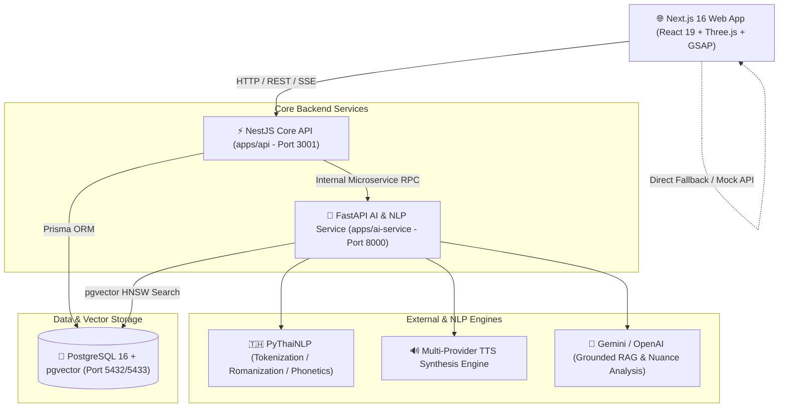

# 🇹🇭 THAI CONTEXT

<div align="center">


### **“ไม่ต้องรู้คำ ก็รู้ว่าควรใช้คำไหน”**
**Next-Generation Semantic Thai Language Exploration & Context Intelligence Platform**  
*Hackathon Edition: “เปิดคลังคำ พลิกคลังคิด”*

[](https://nextjs.org/)
[](https://react.dev/)
[](https://nestjs.com/)
[](https://fastapi.tiangolo.com/)
[](https://python.org/)
[](https://github.com/pgvector/pgvector)
[](https://prisma.io/)
[](https://typescriptlang.org/)
[](https://vitest.dev/)
[](https://docker.com/)

[ฟีเจอร์เด่น](#-ฟีเจอร์เด่น-core-features) •
[สถาปัตยกรรมระบบ](#-สถาปัตยกรรมระบบ-system-architecture) •
[เทคโนโลยีที่ใช้](#-เทคโนโลยีที่ใช้-tech-stack) •
[เริ่มต้นใช้งาน](#-เริ่มต้นใช้งาน-quick-start) •
[การทดสอบ](#-การทดสอบระบบ-testing) •
[เอกสารอ้างอิง](#-เอกสารอ้างอิง-documentation)

</div>

---

## 🌟 ภาพรวมโครงการ (Overview)

**THAI CONTEXT** พลิกโฉมการค้นหาและทำความเข้าใจพจนานุกรมภาษาไทยแบบดั้งเดิม จากเดิมที่ผู้ใช้ต้อง *"รู้คำศัพท์ก่อน ถึงจะเปิดหาความหมายได้"* สู่ระบบ **Dictionary Intelligence** ที่ผู้ใช้เพียงอธิบายความคิด ความรู้สึก เจตนา หรือบริบทที่ต้องการสื่อสาร ระบบจะทำการวิเคราะห์ความหมาย ค้นหาคำศัพท์ที่เหมาะสม เปรียบเทียบความแตกต่าง และเชื่อมโยงคลังข้อมูลพจนานุกรมข้ามยุคสมัยและภาษาถิ่นได้อย่างชาญฉลาด

```text
🔴 Traditional Flow : รู้คำศัพท์ ───────► ค้นหาคำ ─────────► อ่านความหมาย
🟢 THAI CONTEXT Flow : รู้สิ่งที่อยากสื่อ ──► อธิบายบริบท ──► ค้นพบคำศัพท์ ──► เปรียบเทียบความต่าง ──► เข้าใจประวัติและภาษาถิ่น
```

### 📊 สถิติและความพร้อมของฐานข้อมูล (Real Thai Dataset)
- **29,544+ แม่คำภาษาไทย** (คัดสรรจากพจนานุกรมฉบับราชบัณฑิตยสถาน และ Wiktextract)
- **36,398+ รายการความหมาย** พร้อมระบุชนิดของคำ (POS) และลำดับ Sense อย่างละเอียด
- **29,612+ เวกเตอร์ความหมาย** (1536-dimensional HNSW Index บน PostgreSQL + pgvector)
- **84+ รายการคำภาษาถิ่น ๔ ภาค** (เหนือ, อีสาน, ใต้, กลาง)
- **100% Functional Requirements Compliance** ผ่านเกณฑ์ทดสอบทั้ง 18 ข้อ (`FR-01` ถึง `FR-18`)

---

## ✨ ฟีเจอร์เด่น (Core Features)

### 1. 🔍 ค้นหาตามความหมายและบริบท (Meaning-First & Contextual Search)
- ค้นหาด้วยภาษาธรรมชาติโดยไม่ต้องทราบคำศัพท์ล่วงหน้า เช่น พิมพ์ *"คนที่ประหยัดเงินมากๆ จนแทบไม่ยอมจ่ายอะไรเลย"* ระบบแนะนำคำว่า **"ตระหนี่"**, **"มัธยัสถ์"**, **"ขี้เหนียว"**
- รองรับการคัดกรองคำที่ไม่ต้องการ (Excluded Words / Negative Constraints)
- ระบบ Ranking ไฮบริด (Semantic Vector 60% + Keyword Match 20% + Context Intent 15% + Source Credibility 5%)

### 2. ⚖️ เปรียบเทียบความต่างของคำ (Multi-Word Nuance Comparator)
- เปรียบเทียบคำศัพท์ที่มีความหมายใกล้เคียงกันแบบ Side-by-Side
- แสดงระดับความเป็นทางการ (Register: ทางการ, กึ่งทางการ, ภาษาพูด, ภาษาเขียน)
- วิเคราะห์ความแตกต่างทางอารมณ์และภาพลักษณ์ (Connotation / Sentiment / Nuance)
- แสดงประโยคตัวอย่างการนำไปใช้จริงในบริบทที่ถูกต้อง

### 3. ⏳ สำรวจวิวัฒนาการคำ (Lexical Evolution Timeline)
- สำรวจการเปลี่ยนแปลงของคำศัพท์ข้าม 3 ยุคสมัยของราชบัณฑิตยสถาน:
  - **พ.ศ. ๒๕๔๒** (ฉบับพิมพ์คลาสสิก)
  - **พ.ศ. ๒๕๕๔** (ฉบับปรับปรุงครั้งใหญ่)
  - **พ.ศ. ๒๕๖๙** (ฉบับดิจิทัลสมัยใหม่)
- ระบุสถานะการเปลี่ยนแปลงชัดเจน: `ADDED` (เพิ่มใหม่), `CHANGED` (ความหมายเปลี่ยน/ขยาย), `UNCHANGED` (คงเดิม), `DEPRECATED` (เลิกใช้)

### 4. 🗺️ สำรวจภาษาถิ่น ๔ ภาค (Regional Dialect Explorer)
- เชื่อมโยงคำภาษากลางสู่ภาษาถิ่น: **ภาษาเหนือ (คำเมือง)**, **ภาษาอีสาน**, **ภาษาใต้**
- ระบุวรรณยุกต์ สำเนียง และบริบทการใช้ในท้องถิ่น พร้อมตัวอย่างประโยคจริง

### 5. ♿ เข้าถึงได้สำหรับทุกคน (Universal Accessibility)
- **อักษรเบรลล์ภาษาไทย (Thai Braille)**: แปลงคำศัพท์เป็นสัญลักษณ์เบรลล์ 6 จุด (6-dot cell rendering) และตารางถอดรหัส Braille Keypad แบบ Reverse Interactive
- **ภาษามือไทย (Thai Sign Language - TSL)**: คลิปวิดีโอและภาพ 3D Avatar/Kinematics แสดงท่ามือ พร้อมคำอธิบายรูปมือและการเคลื่อนไหว โดยอ้างอิงข้อมูลมาตรฐานจากวิทยาลัยราชสุดา มหาวิทยาลัยมหิดล
- **ระบบเสียงอ่านออกเสียง (High-Fidelity Text-to-Speech)**: รองรับการสังเคราะห์เสียงฝั่งเซิร์ฟเวอร์แบบ Zero-Crash Audio Caching พร้อม Fallback อัตโนมัติไปยัง Web Speech API บนเบราว์เซอร์
- **ระบบติดป้ายกำกับแหล่งที่มา (Strict Provenance Badging)**: แยกแยะชัดเจนระหว่างข้อมูลทางการจากราชบัณฑิต (🏛️/📜 Official) กับคำแนะนำจากปัญญาประดิษฐ์ (🤖 AI Guidance)

### 6. 🔀 สุ่มเปลี่ยนคำและแต่งประโยค (Word Scrambler & Quirkifier)
- เครื่องมือสลับคำศัพท์ในประโยคด้วยคำพ้องความหมาย คำสแลง หรือภาษาถิ่น
- ช่วยจุดประกายความคิดสร้างสรรค์สำหรับนักเขียนและคอนเทนต์ครีเอเตอร์

### 7. ⚡ AI Workspace & ผู้ช่วยภาษาไทย (Multi-Agent Studio & AI Assistant)
- **AI Workspace**: พื้นที่ทำงานสำหรับตรวจสอบ ขัดเกลาสำนวน ปรับระดับความสุภาพ และเทียบคำศัพท์หลายเวอร์ชัน
- **ผู้ช่วย AI**: แชตบอตถาม-ตอบประเด็นภาษาไทย ทำงานบนระบบ Grounded RAG with Anti-Hallucination Guard ไม่มีการแต่งเติมข้อมูลพจนานุกรมขึ้นเอง

---

## 🏗️ สถาปัตยกรรมระบบ (System Architecture)



### รายละเอียดของแต่ละเซอร์วิส:
1. **`frontend/` (Next.js App Router):**
   - **Framework:** Next.js 16.3, React 19, TypeScript
   - **UI & Animation:** GSAP 3 (ScrollTrigger, Flip), Three.js + @react-three/fiber (3D Book & Interactive Visuals), Tailwind CSS Custom Architecture
   - **Accessibility:** ARIA 1.2 Compliant, Keyboard navigable, Screen-reader optimized, Braille & Sign Language modals
2. **`apps/api/` (NestJS Core Backend):**
   - **Framework:** NestJS 10.3, Prisma ORM 5.10
   - **Responsibilities:** Routing, Data validation (class-validator), Authentication & rate limiting, Aggregated endpoints, Swagger UI (`/api/docs`)
3. **`apps/ai-service/` (FastAPI AI Microservice):**
   - **Framework:** FastAPI, Python 3.11+
   - **NLP Pipeline:** PyThaiNLP (newmm tokenizer, royin romanization, G2P), SHA-256 Audio cache, Vector search with cosine similarity, Grounded RAG with Hallucination Guard

---

## 💻 เทคโนโลยีที่ใช้ (Tech Stack)

| ส่วนประกอบ | เทคโนโลยี | รายละเอียด |
| :--- | :--- | :--- |
| **Frontend** | Next.js 16, React 19, TypeScript | App Router, Server/Client Components, Turbopack |
| **Styling & Motion** | CSS Modules, GSAP 3, Three.js, Lucide Icons | Liquid glass design, 3D Book canvas, Micro-interactions |
| **Testing (Web)** | Vitest 5, Testing Library, Playwright | Unit tests, Integration tests, Component testing |
| **Core API** | NestJS 10, Prisma ORM, Node.js 20+ | RESTful APIs, Swagger OpenAPI, Modular architecture |
| **AI & NLP** | FastAPI, Python 3.11+, PyThaiNLP | Semantic embeddings, Vector similarity, Grounded RAG |
| **Database** | PostgreSQL 16 + `pgvector` | 19 Relational tables, HNSW Indexing (1536-dim vectors) |
| **Container** | Docker, Docker Compose | Multi-container setup with healthchecks and auto-recovery |

---

## 🚀 เริ่มต้นใช้งาน (Quick Start)

### วิธีที่ 1: รันทุกเซอร์วิสผ่าน Docker Compose (แนะนำ)

ตรวจสอบว่าติดตั้ง Docker Desktop เรียบร้อยแล้ว จากนั้นรันคำสั่ง:

```bash
# 1. Clone repository
git clone https://github.com/Phoomss/thai-context.git
cd thai-context

# 2. คัดลอก environment template
cp .env.example .env

# 3. รันทั้งระบบด้วย Docker Compose
docker compose up --build
```

#### บริการที่พร้อมใช้งาน:
- **Web Frontend:** [http://localhost:3000](http://localhost:3000)
- **NestJS Core API:** [http://localhost:3001](http://localhost:3001)
- **Core API Health Check:** [http://localhost:3001/health](http://localhost:3001/health)
- **Swagger Documentation:** [http://localhost:3001/api/docs](http://localhost:3001/api/docs)
- **FastAPI AI Service:** [http://localhost:8000](http://localhost:8000)
- **FastAPI Interactive Docs:** [http://localhost:8000/docs](http://localhost:8000/docs)

---

### วิธีที่ 2: รันแยกแต่ละเซอร์วิสสำหรับการพัฒนา (Local Development)

#### 1. ความต้องการของระบบ (Prerequisites)
- **Node.js** >= 20.x
- **pnpm** >= 9.x หรือ **npm**
- **Python** >= 3.11
- **Docker** (สำหรับ PostgreSQL + pgvector)

#### 2. รันฐานข้อมูล PostgreSQL + pgvector
```bash
docker compose up -d postgres
```

#### 3. ติดตั้งและเริ่มทำงาน NestJS Core API (`apps/api`)
```bash
cd apps/api
npm install
npx prisma generate
npx prisma db push
npm run seed
npm run start:dev
```

#### 4. ติดตั้งและเริ่มทำงาน AI Microservice (`apps/ai-service`)
```bash
cd apps/ai-service
python -m venv .venv

# Windows:
.venv\Scripts\activate
# macOS/Linux:
source .venv/bin/activate

pip install -r requirements.txt
python -m app.main
```

#### 5. ติดตั้งและเริ่มทำงาน Next.js Web Frontend (`frontend`)
```bash
cd frontend
pnpm install
pnpm dev
```
เปิดบราวเซอร์ที่ [http://localhost:3000](http://localhost:3000)

---

## 🧪 การทดสอบระบบ (Testing)

โปรเจกต์มีชุดทดสอบครอบคลุมทุกระดับชั้นสถาปัตยกรรม:

```bash
# 1. ทดสอบ Frontend Unit & Component Tests (26 test files / 215+ tests)
cd frontend
pnpm test

# 2. ตรวจสอบ TypeScript Types ของ Frontend
pnpm run typecheck

# 3. ทดสอบการ Build Frontend เป็น Production
pnpm run build

# 4. ทดสอบ NestJS API Backend
cd ../apps/api
npm test

# 5. ทดสอบ Core API Smoke Test (ทดสอบทุก Core Endpoints)
npm run test:smoke

# 6. ทดสอบ Python AI Service
cd ../apps/ai-service
pytest
```

---

## 📖 สรุปรายการ API Endpoints ที่สำคัญ

| Method | Path | หน้าที่และรายละเอียด |
| :--- | :--- | :--- |
| `GET` | `/health` | ตรวจสอบสถานะการทำงานของ API Core |
| `GET` | `/api/v1/search?q=:query` | ค้นหาคำศัพท์ด้วยคีย์เวิร์ด (รองรับ partial match, edition filter) |
| `POST` | `/api/v1/search/meaning` | ค้นหาจากความหมายและเจตนา (“ไม่ต้องรู้คำ ก็รู้ว่าควรใช้คำไหน”) |
| `POST` | `/api/v1/search/context` | ค้นหาคำศัพท์พร้อมระบุบริบทและคำต้องห้าม (Excluded Words) |
| `GET` | `/api/v1/dictionary/words/:word` | ข้อมูลคำศัพท์ฉบับเต็ม พร้อมแยกส่วนข้อมูลทางการและ AI Guidance |
| `GET` | `/api/v1/dictionary/words/:word/evolution` | ไทม์ไลน์วิวัฒนาการคำข้ามยุค ๒๕๔๒ ➔ ๒๕๕๔ ➔ ๒๕๖๙ |
| `GET` | `/api/v1/dictionary/words/:word/translations` | คำแปลและศัพท์บัญญัติทางการ พร้อมระดับความน่าเชื่อถือ |
| `GET` | `/api/v1/dictionary/words/:word/sign-language` | ข้อมูลท่าภาษามือไทย (TSL), ท่ามือ, แหล่งอ้างอิง และวิดีโอ |
| `GET` | `/api/v1/dictionary/words/:word/braille` | สัญลักษณ์อักษรเบรลล์ไทย 6 จุด และ Unicode Pattern |
| `POST` | `/api/v1/dictionary/braille/decode` | ถอดรหัสแป้นกดจุดเบรลล์กลับมาเป็นอักขระและคำภาษาไทย |
| `POST` | `/api/v1/tts/synthesize` | สังเคราะห์เสียงอ่านออกเสียงภาษาไทยฝั่งเซิร์ฟเวอร์ |
| `POST` | `/api/v1/compare` | เปรียบเทียบความหมาย ความรู้สึก และระดับภาษาของคำศัพท์หลายคำ |
| `GET` | `/api/v1/dialect` | สำรวจหมวดหมู่คำภาษาถิ่น ๔ ภาค (เหนือ, อีสาน, ใต้, กลาง) |
| `GET` | `/api/v1/dialect/mapping/:word` | จับคู่คำภาษากลางกับภาษาถิ่น พร้อมความแตกต่างทางบริบท |
| `POST` | `/api/v1/ai/chat/stream` | สนทนาภาษาไทยผ่าน Grounded RAG with Hallucination Guard แบบ Stream |
| `POST` | `/api/v1/feedback` | บันทึกข้อเสนอแนะและ Feedback ของผู้ใช้งานเพื่อปรับปรุงระบบ |

---

## 📁 โครงสร้างโปรเจกต์ (Project Structure)

```text
thai-context/
├── apps/
│   ├── ai-service/              # FastAPI Python Microservice (NLP, RAG, TTS, Vectors)
│   │   ├── app/
│   │   │   ├── api/             # API Router & Endpoints
│   │   │   ├── core/            # Config, Security, Environment
│   │   │   ├── models/          # Pydantic Schemas & DTOs
│   │   │   └── services/        # PyThaiNLP, RAG, TTS, Embedding engines
│   │   ├── Dockerfile
│   │   └── requirements.txt
│   └── api/                     # NestJS Core Application Backend
│       ├── prisma/              # Prisma Schema & Database Seeder
│       ├── src/
│       │   └── modules/         # Search, Dictionary, Evolution, Dialect, Accessibility
│       ├── Dockerfile
│       └── package.json
├── frontend/                    # Next.js 16 Web Application
│   ├── public/assets/           # Logos, SVG icons, static models
│   ├── src/
│   │   ├── app/                 # Next.js App Router Pages & API Proxies
│   │   ├── components/          # Reusable UI Components
│   │   │   ├── compare/         # Multi-Word Comparator
│   │   │   ├── dialect/         # Dialect Explorer Cards
│   │   │   ├── evolution/       # Lexical Evolution Timeline
│   │   │   ├── hero/            # 3D Book Canvas & Liquid Glass Search
│   │   │   ├── search/          # Word Result Cards & Filters
│   │   │   ├── tsl/             # Sign Language 3D/Video Player
│   │   │   └── braille/         # Braille Grid & Keypad Decoder
│   │   └── lib/                 # Audio manager, API client, mock data, types
│   ├── tests/                   # Vitest Unit & Integration Suites
│   └── package.json
├── data/                        # Dictionary Datasets & Wordlists
├── docs/                        # เอกสารสถาปัตยกรรมและข้อกำหนดระบบฉบับเต็ม
├── scripts/                     # Shell & Ingestion Utilities
├── docker-compose.yml           # Multi-Container Orchestration
└── README.md                    # Project Master Documentation
```

---

## 📚 เอกสารอ้างอิงเพิ่มเติม (Documentation Suite)

สามารถอ่านเอกสารข้อกำหนดเชิงลึก สถาปัตยกรรมระบบ และคู่มือคณะกรรมการได้ในโฟลเดอร์ [`docs/`](file:///C:/src/thai-context/docs):
- [**Product Requirements Document (PRD)**](docs/01-product-requirements.md): ปัญหา คุณค่าระบบ 18 FRs และ 12 NFRs
- [**Database Architecture & Schema**](docs/02-database-architecture.md): การออกแบบ 19 Tables, pgvector และกลยุทธ์ Indexing
- [**System Architecture & RAG Pipeline**](docs/03-system-architecture.md): โฟลว์ Hybrid Search และการป้องกัน Hallucination
- [**Master Documentation Hub**](docs/README.md): สารบัญเอกสารฉบับสมบูรณ์สำหรับคณะกรรมการ

---

<div align="center">

สร้างสรรค์ด้วยความภาคภูมิใจสำหรับงานแข่งขัน Hackathon **“เปิดคลังคำ พลิกคลังคิด”**  
*THAI CONTEXT Team — 2026*

</div>
