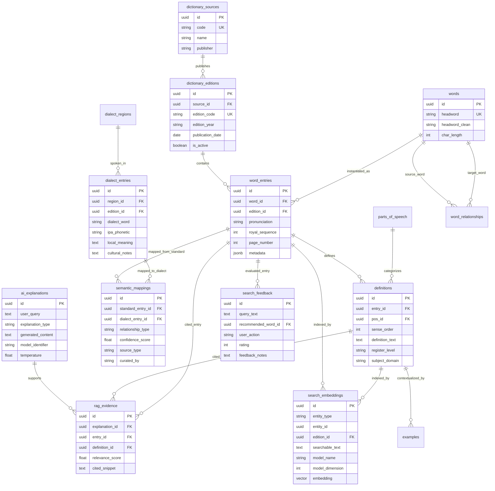
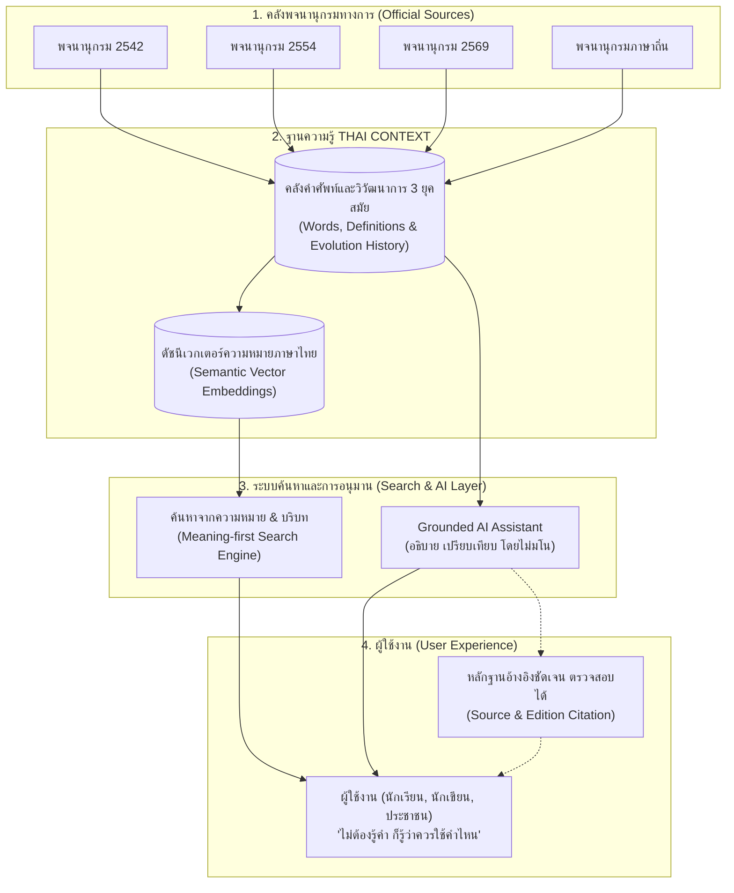

# 🗄️ THAI CONTEXT — Database Architecture & Data Model
> **Module 02:** Production-Quality Hybrid Relational & Vector Schema Design

---

## 1. Important Data Model Principles

การออกแบบฐานข้อมูล THAI CONTEXT ยึดถือหลักการ **5 Data Layers Separation** เพื่อให้ระบบมีเสถียรภาพและอธิบายต่อกรรมการได้ชัดเจน:

1. **Source & Edition Layer (Immutable Catalog):** บันทึกแหล่งที่มา (ราชบัณฑิตยสถาน, สถาบันภาษาถิ่น) และฉบับพิมพ์ (2542, 2554, 2569) ห้ามบันทึกทับข้อมูลประวัติศาสตร์
2. **Canonical Lexical Layer (Normalized Lexicon):** แยกคำศัพท์หลัก (`words`) ออกจากรูปจำเพาะในแต่ละฉบับ (`word_entries`) และนิยามความหมาย (`definitions`) เพื่อตรวจจับความเปลี่ยนแปลงข้ามยุคสมัย
3. **Semantic Layer (Dense Vectors):** จัดเก็บ Vector Embeddings ของคำและความหมายแยกต่างหาก รองรับการค้นหาเชิงความหมายผ่านส่วนขยาย `pgvector`
4. **Grounded AI & Audit Layer:** คำตอบของ AI จะไม่เขียนทับข้อมูลจริงในพจนานุกรม แต่บันทึกในตาราง `ai_explanations` และเชื่อมโยงผ่าน `rag_evidence`
5. **User Feedback Layer:** จัดเก็บพฤติกรรมการค้นหาและการให้คะแนนเพื่อนำมาพัฒนา Ranking Algorithm

---

## 2. Entity Descriptions & Rationale

| Entity (Table Name) | เลเยอร์ | เหตุผลในการมีอยู่และหน้าที่ทางเทคนิค |
| :--- | :--- | :--- |
| **`dictionary_sources`** | Source | ระบุเจ้าของลิขสิทธิ์และองค์กรผู้จัดทำ เพื่อการตรวจสอบ Data Lineage |
| **`dictionary_editions`** | Source | ระบุปี พ.ศ. และฉบับพิมพ์ เป็นตัวควบคุมการแยกประวัติศาสตร์คำศัพท์ |
| **`parts_of_speech`** | Lexical | ชนิดของคำตามหลักภาษาไทย (น., ก., ว., ฯลฯ) |
| **`dialect_regions`** | Lexical | ภูมิภาคของภาษาถิ่น (เหนือ, ตะวันออกเฉียงเหนือ, ใต้, กลาง) |
| **`words`** | Lexical | Canonical Word / Lemma ทำหน้าที่เป็นตัวเชื่อมโยงคำเดียวกันข้ามหลาย Edition |
| **`word_entries`** | Lexical | การปรากฏของคำในแต่ละฉบับ มี `word_id` + `edition_id` เพื่อวิเคราะห์ Evolution |
| **`definitions`** | Lexical | นิยามความหมายแยกตาม Sense (ข้อ 1, 2, 3) พร้อมระดับภาษาและสาขาวิชา |
| **`examples`** | Lexical | ตัวอย่างประโยคการใช้ตามที่ปรากฏในพจนานุกรม |
| **`dialect_entries`** | Lexical | คำศัพท์ภาษาถิ่น คำอ่านสำเนียงท้องถิ่น และบริบททางวัฒนธรรม |
| **`word_relationships`** | Semantic | เครือข่ายความสัมพันธ์ระหว่างคำ เช่น คำพ้อง (Synonym), คำตรงข้าม (Antonym) |
| **`semantic_mappings`** | Semantic | สะพานเชื่อมภาษากลาง $\leftrightarrow$ ภาษาถิ่น มี Flag ระบุ `OFFICIAL_DATA` หรือ `AI_INFERRED` |
| **`search_embeddings`** | Semantic | คอลัมน์ Vector รองรับการทำ Dense Cosine Similarity ด้วย HNSW Index |
| **`ai_explanations`** | Grounded AI | บันทึกคำอธิบายเปรียบเทียบและการแนะนำที่สร้างโดย LLM |
| **`rag_evidence`** | Grounded AI | เก็บ Foreign Key ชี้ชัดว่าคำตอบของ AI อ้างอิงมาจากข้อความใดในพจนานุกรมเล่มไหน |
| **`search_feedback`** | Feedback | บันทึกคะแนนและการประเมินของผู้ใช้เพื่อนำมาปรับจูน Ranking Weight |

---

## 3. Technical ERD (Mermaid)



---

## 4. Simplified Data Model (สำหรับนำเสนอกรรมการ)



---

## 5. Indexing Strategy

1. **Exact Lookups (B-Tree):** สร้างดัชนี B-Tree บน Foreign Keys ทุกจุด (`word_id`, `edition_id`, `entry_id`, `pos_id`) เพื่อรองรับการ JOIN ตารางที่ว่องไว
2. **Thai Fuzzy & Keyword Search (GIN Trigram):** ใช้ `pg_trgm` บนคอลัมน์ `words.headword`, `words.headword_clean`, และ `definitions.definition_text`
3. **High-Recall Vector Search (HNSW on pgvector):**
   ```sql
   CREATE INDEX idx_search_embeddings_vector_hnsw 
   ON search_embeddings 
   USING hnsw (embedding vector_cosine_ops)
   WITH (m = 16, ef_construction = 64);
   ```
   - **`m = 16`**: ความสมดุลที่ดีที่สุดระหว่าง Memory Footprint กับ Latency
   - **`ef_construction = 64`**: รับประกันค่า Recall สูงสำหรับการสืบค้นเชิงความหมาย

---

## 6. Functional Requirement $\rightarrow$ Database Mapping

| Requirement | ตารางหลักที่ใช้งาน | กลไกทางเทคนิค |
| :--- | :--- | :--- |
| **FR-01 Keyword Search** | `words`, `word_entries` | ค้นหาผ่าน GIN Trigram Index บน `headword` |
| **FR-02 Meaning-first Search** | `search_embeddings`, `definitions`, `word_entries` | คำนวณ Cosine Distance กับคำบรรยายความหมายของผู้ใช้ |
| **FR-03 Semantic Search** | `search_embeddings` | Dense Vector Search ผ่านส่วนขยาย `pgvector` |
| **FR-04 Query Understanding** | `search_embeddings`, `definitions` | แปลง Intent และ Exclusion Words เป็น Filter เงื่อนไข |
| **FR-05 Context Recommendation** | `word_entries`, `definitions`, `search_embeddings` | รวมคะแนน Semantic + Context Relevance + Evidence |
| **FR-06 Explain Recommendation** | `definitions`, `dictionary_editions` | ดึงนิยามและระบุหน้า/ปีพิมพ์ แสดงเป็นเหตุผล |
| **FR-07 Word Detail** | `word_entries`, `definitions`, `parts_of_speech`, `examples` | Query แสดงโครงสร้างคำศัพท์ครบถ้วน |
| **FR-08 Multi-Version Dict** | `dictionary_sources`, `dictionary_editions`, `word_entries` | แยกข้อมูลตาม `edition_code` ไม่ปะปนกัน |
| **FR-09 Dict Evolution** | `words`, `word_entries`, `dictionary_editions` | Group by `word_id` เพื่อเรียง Timeline 2542 $\rightarrow$ 2554 $\rightarrow$ 2569 |
| **FR-10 Dict Change Detection** | `word_entries`, `definitions` | เปรียบเทียบ Text Diff ระหว่างนิยามแต่ละปีพิมพ์ |
| **FR-11 Dialect Explorer** | `dialect_regions`, `dialect_entries` | Filter ตามภูมิภาค พร้อมแสดงคำอ่านสำเนียงท้องถิ่น |
| **FR-12 Standard ↔ Dialect** | `semantic_mappings`, `word_entries`, `dialect_entries` | แมปคู่คำศัพท์ พร้อมป้ายกำกับ `OFFICIAL_DATA` หรือ `AI_INFERRED` |
| **FR-13 Context Compare** | `word_entries`, `definitions`, `parts_of_speech` | Query มากกว่า 1 คำมาแสดงผลแบบ Side-by-Side |
| **FR-14 Usage Guidance** | `definitions`, `examples`, `ai_explanations` | ระบุระดับภาษา (Register) และคำแนะนำสถานการณ์ที่ควรใช้ |
| **FR-15 RAG-based AI** | `search_embeddings`, `definitions`, `ai_explanations` | ดึงนิยามจาก DB ใส่เป็น Context Prompt ส่งให้ LLM |
| **FR-16 Source & Evidence** | `rag_evidence`, `word_entries`, `dictionary_editions` | บันทึกความสัมพันธ์ระดับ Foreign Key ระหว่างคำตอบกับระเบียนจริง |
| **FR-17 Hallucination Guard** | `search_embeddings` | ตรวจสอบ Similarity Score หากต่ำกว่าเกณฑ์จะตอบ Abstention |
| **FR-18 Search Feedback** | `search_feedback` | บันทึกคลิกและคะแนนดาวเพื่อปรับปรุง Ranking Algorithm |
