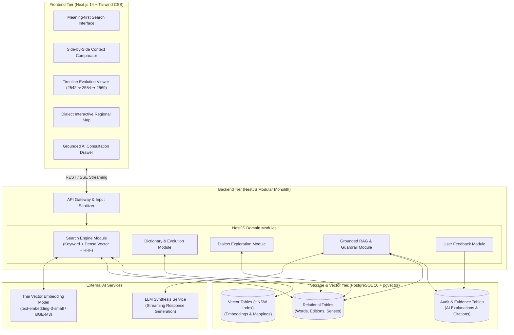
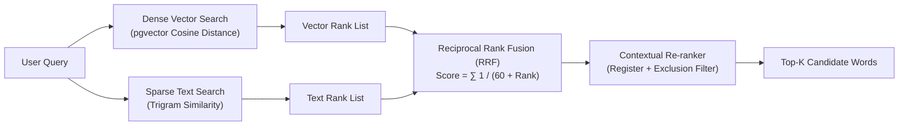
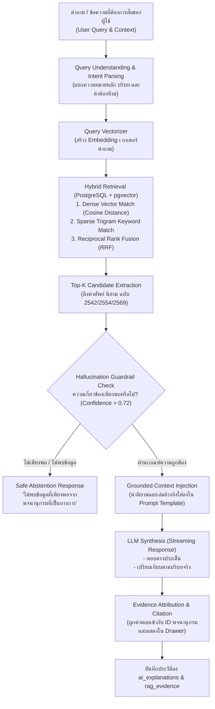
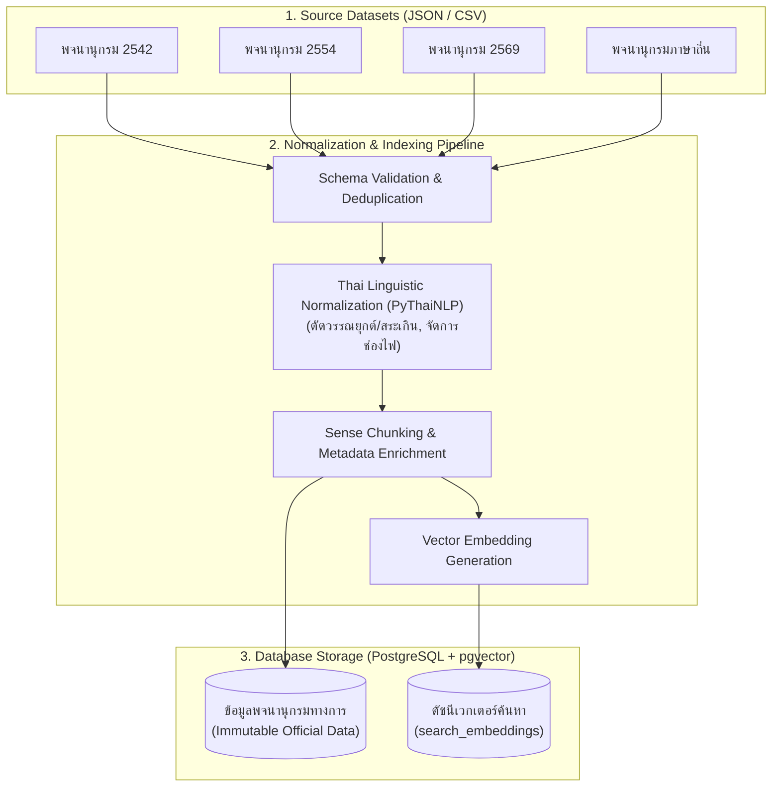

# 🏗️ THAI CONTEXT — System Architecture & RAG Pipeline
> **Module 03:** System Architecture, Hybrid Retrieval Engine & Grounded RAG Specifications

---

## 1. System Architecture Topology (Mermaid)



---

## 2. Hybrid Search Strategy & RRF Ranking

เพื่อให้การสืบค้นครอบคลุมทั้งตัวสะกดที่ตรงกัน (Lexical) และมิติความหมายที่ลึกซึ้ง (Semantic) ระบบใช้กลไก **Hybrid Retrieval Engine**:



### สูตรการคำนวณ Reciprocal Rank Fusion (RRF)
$$RRF(d) = \frac{w_{\text{dense}}}{60 + r_{\text{dense}}(d)} + \frac{w_{\text{sparse}}}{60 + r_{\text{sparse}}(d)}$$

- **Dense Search:** สกัดเวกเตอร์ความหมายผ่าน Embedding Model และค้นหาด้วย Cosine Distance
- **Sparse Search:** ค้นหาตัวสะกดและคำบางส่วนด้วย `pg_trgm` (GIN Index)
- **Constraint Filtering:** ตัดคำที่เป็น Negative Constraint (เช่น "ไม่อยากใช้คำว่าเร็ว") ออกจากผลลัพธ์

---

## 3. Grounded RAG Flow & Anti-Hallucination Architecture



### Strict System Prompt Design
```text
[SYSTEM INSTRUCTION]
คุณคือผู้เชี่ยวชาญด้านภาษาไทยสำหรับแพลตฟอร์ม THAI CONTEXT
หน้าที่ของคุณคือช่วยผู้ใช้เลือกคำ เปรียบเทียบคำ และให้คำแนะนำการใช้ภาษาไทย

[GROUNDING RULES]
1. จงตอบคำถามโดยใช้เฉพาะข้อมูลใน [DICTIONARY CONTEXT] ที่แนบมานี้เท่านั้น
2. ห้ามแต่งคำแปล สันนิษฐาน หรือสร้างคำศัพท์ใหม่ที่ไม่มีปรากฏในหลักฐาน
3. ทุกคำแนะนำต้องระบุชื่อเล่มและปี พ.ศ. ของพจนานุกรมที่ใช้อ้างอิง
4. หากข้อมูลในบริบทไม่เพียงพอ จงตอบว่า:
   "ไม่พบข้อมูลที่เพียงพอจากคลังพจนานุกรมฉบับทางการที่ระบบรองรับ"
```

---

## 4. Data Ingestion & Normalization Flow (Mermaid)



---

## 5. Technical Decisions & Architectural Rationales

| การตัดสินใจ | ทางเลือกอื่นที่พิจารณา | เหตุผลและความเหมาะสมสำหรับ Hackathon |
| :--- | :--- | :--- |
| **PostgreSQL + pgvector** | Milvus, Pinecone, Qdrant | รวมทุกอย่างไว้ในฐานข้อมูลเดียว ไม่ต้องบริหารจัดการ Cluster สองตัว สามารถเขียน Single SQL ที่ JOIN ข้อมูลประวัติศาสตร์พจนานุกรมเข้ากับ Vector Similarity ได้ทันที |
| **NestJS (Modular Monolith)** | Microservices | เหมาะกับระยะเวลาพัฒนาที่จำกัด มี Dependency Injection ที่แข็งแกร่ง มีโครงสร้าง Domain Module ชัดเจน สามารถสเกลขึ้น Production หรือแยก Service ได้ง่ายในอนาคต |
| **Next.js 14 + Tailwind CSS** | Vite SPA | รองรับ Server-Side Rendering (SSR) ช่วยเรื่องการแสดงผลฟอนต์ภาษาไทย และรองรับ Server-Sent Events (SSE) สำหรับการแสดงผล LLM แบบ Streaming อย่างลื่นไหล |
| **HNSW Vector Index** | IVFFlat Index | HNSW ให้ค่า Recall ที่สูงกว่า และไม่ต้องรอ Re-train ดัชนีเมื่อมีการเพิ่มข้อมูลคำศัพท์ใหม่ |
