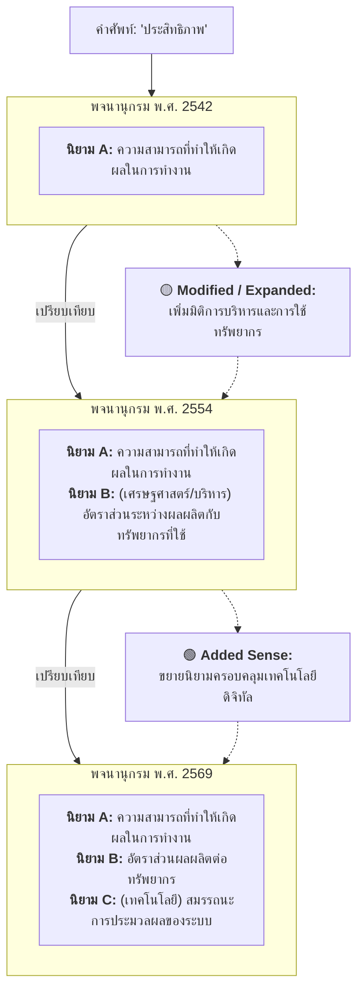
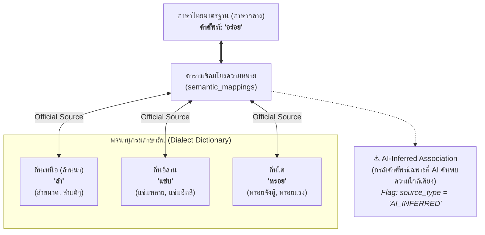
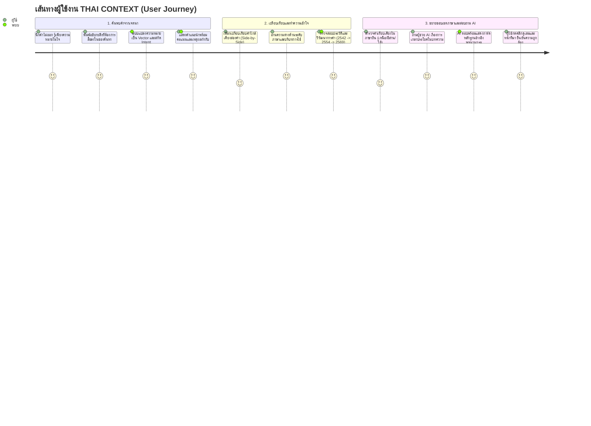

# 🧭 THAI CONTEXT — User Journey & Experience Flows
> **Module 04:** Interactive Flows, Diagrams & Hackathon Final Demo Script

---

## 1. Meaning-first Search Flow (Mermaid)

---

## 2. Dictionary Evolution Flow (Mermaid)

---

## 3. Dialect Exploration Flow (Mermaid)

---

## 4. End-to-End User Journey (Mermaid)

---

## 5. 9-Step Final Demo Script (บทสาธิตสำหรับ Pitching)

> [!IMPORTANT]
> **หลักการนำเสนอต่อหน้ากรรมการ:**  
> อย่านำเสนอแยกฟีเจอร์เดี่ยว ๆ ให้ร้อยเรียงเป็น **"เรื่องราวเดียวที่ต่อเนื่อง (Single Storyline Arc)"** ผ่าน 9 สเต็ปนี้:

1. **Step 1 — The Dilemma (ปัญหาจริง):**  
   ผู้ใช้ต้องการเขียนข้อความประเมินพนักงาน แต่ติดอยู่ที่ความหมาย:  
   *“อยากบอกว่าคนคนนี้ทำงานได้ผลลัพธ์ดีเลิศ ใช้เวลาและงบประมาณคุ้มค่าที่สุด แต่ไม่อยากใช้คำว่า 'เก่ง' หรือ 'เร็ว'”*
2. **Step 2 — Meaning-first Search:**  
   พิมพ์ประโยคข้างต้นลงใน Search Bar ระบบสกัด Intent และตัด Negative Constraints ทิ้ง
3. **Step 3 — Smart Recommendation:**  
   หน้าจอแสดงการ์ดอันดับ 1: **"ประสิทธิภาพ"** (Match Score 94%) พร้อมระบุเหตุผลและหลักฐานจากพจนานุกรม 2569
4. **Step 4 — Side-by-Side Comparison:**  
   ผู้ใช้กดปุ่มเปรียบเทียบคำคู่เคียง: **"ประสิทธิภาพ" vs "ประสิทธิผล"**  
   ระบบแสดงตารางชี้จุดต่าง (Efficiency vs Effectiveness) อย่างชัดเจน
5. **Step 5 — Usage Guidance:**  
   ระบบแสดงแท็กระดับภาษา `FORMAL` เหมาะกับรายงานราชการ งานวิจัย หรือบทความทางวิชาการ
6. **Step 6 — Time-Travel Evolution:**  
   ผู้ใช้กดดูแท็บ Timeline วิวัฒนาการคำ เห็นการเปลี่ยนผ่านความหมายจาก 2542 $\rightarrow$ 2554 $\rightarrow$ 2569 ที่ปรับตัวตามยุคเศรษฐกิจดิจิทัล
7. **Step 7 — Dialect Explorer:**  
   กดสำรวจคำเทียบเคียงในภาษาถิ่น แสดงความหลากหลายทางภาษาไทย
8. **Step 8 — Ask AI in Deep Context:**  
   ถามคำถามต่อเนื่อง: *“ถ้าจะนำคำว่า 'ประสิทธิภาพ' ไปเขียนในบทคัดย่องานวิจัย ป.โท ควรเรียบเรียงอย่างไร?”*
9. **Step 9 — Grounded Answer & Evidence Drawer:**  
   AI สังเคราะห์รูปประโยค พร้อมกล่อง Drawer สไลด์ออกมาแสดงข้อความอ้างอิงจาก *พจนานุกรมฉบับราชบัณฑิตยสถาน พ.ศ. 2569 หน้า 820* ยืนยันความแม่นยำทางวิชาการ
