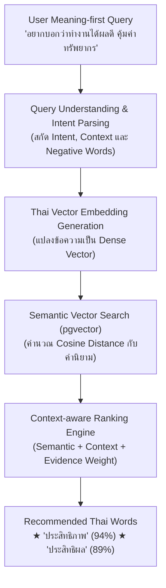
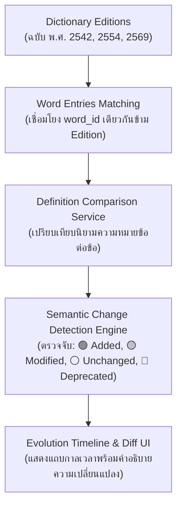
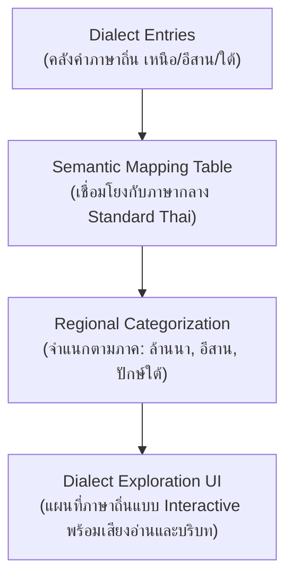
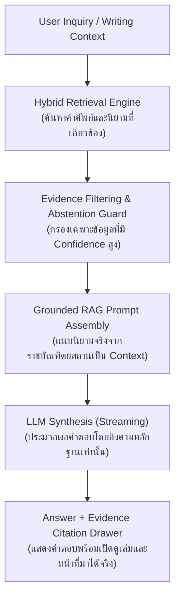
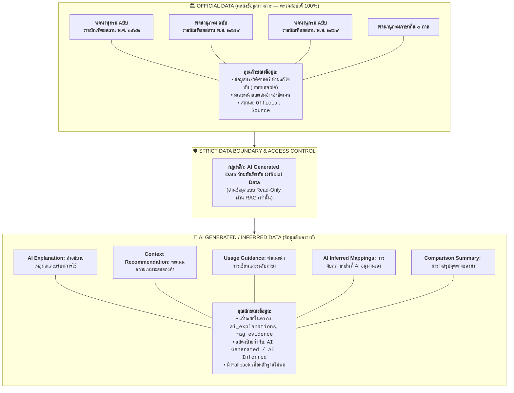
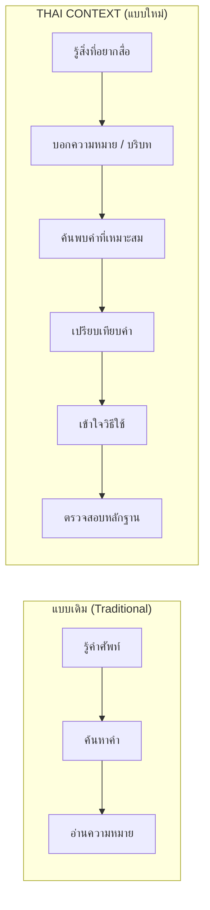
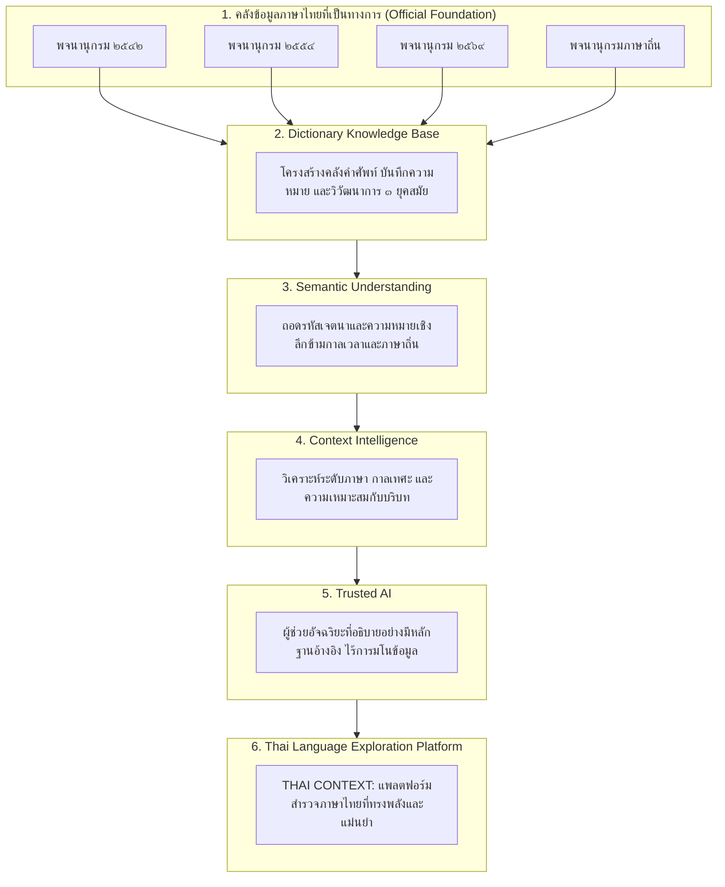
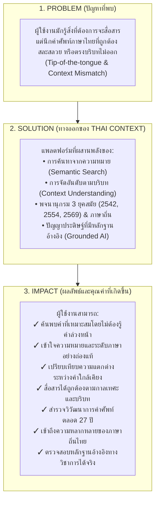

# 📊 THAI CONTEXT — Presentation Diagram Packages & Technical Mappings
> **Module 08:** Hackathon Pitching Diagrams, Architecture Mappings & Demo Journey

---

## 1. Key Feature $\rightarrow$ Technical Architecture Mapping (Section 26)

### 1.1 Meaning-first Search Architecture Flow

### 1.2 Dictionary Evolution Architecture Flow

### 1.3 Dialect Explorer Architecture Flow

### 1.4 Trusted AI & Grounded RAG Architecture Flow

---

## 2. Official Data vs. AI-Generated Data Architecture (Section 27)

> [!IMPORTANT]
> **กำแพงแบ่งแยกข้อมูล (Strict Data Boundary):**  
> ข้อมูลที่สร้างจาก AI จะไม่มีวันเขียนทับข้อมูลจริงของพจนานุกรม และต้องติดป้ายกำกับแหล่งที่มาชัดเจนเสมอ

---

## 3. 10-Second Judge Concept Diagram (Section 28)

> *แผนภาพสำหรับกรรมการ เข้าใจได้ทันทีใน 10 วินาที โดยไม่ใช้คำศัพท์เทคนิคแม้แต่คำเดียว*

---

## 4. From Dictionary to Language Intelligence (Section 29)

> **คำแถลงวิสัยทัศน์:**  
> *"เราไม่ได้สร้างพจนานุกรมใหม่ แต่เราออกแบบวิธีใหม่ในการเข้าถึง เข้าใจ เปรียบเทียบ และเชื่อมโยงคลังคำภาษาไทย"*

---

## 5. Problem $\rightarrow$ Solution $\rightarrow$ Impact (Section 30)

---

## 6. Presentation-Ready User Journey (Section 31)

```mermaid
flowchart LR
    U(["ผู้ใช้งาน"]) --> Q["'อยากบอกอะไร?'<br/>(พิมพ์ความหมาย/บริบท)"]
    Q --> S["Meaning-first Search<br/>(ค้นหาจากเจตนา)"]
    S --> W["Recommended Words<br/>(คำแนะนำที่ตรงบริบท)"]
    W --> E["Why this word?<br/>(ดูเหตุผลและหลักฐาน)"]
    E --> C["Compare Words<br/>(เปรียบเทียบคำคู่แฝด)"]
    C --> G["Usage Guidance<br/>(ดูระดับภาษาและวิธีใช้)"]
    G --> EV["Dictionary Evolution<br/>(ดูการเปลี่ยนผ่าน 3 ยุค)"]
    EV --> D["Dialect Explorer<br/>(สำรวจคู่เทียบภาษาถิ่น)"]
    D --> AI["Ask AI Assistant<br/>(ปรึกษาการเกลาประโยค)"]
    AI --> EV_CARD["Evidence-backed Answer<br/>(คำตอบพร้อมเล่มอ้างอิง)"]
```

---

## 7. The 10-Step Hackathon Demo Story (Section 32)

> ทุกขั้นตอนในการสาธิตจะร้อยเรียงเป็นเนื้อเรื่องเดียวกัน พร้อมแสดง Functional Requirement (FR) ที่ถูกทดสอบในแต่ละสเต็ป:

```mermaid
flowchart TD
    D1["<b>Step 1: ผู้ใช้ป้อนเจตนาเป็นภาษาธรรมชาติ</b><br/>'อยากบอกว่าทำงานได้ผลลัพธ์ดีเลิศ คุ้มค่าทรัพยากร แต่ไม่อยากใช้คำว่าเร็ว'<br/><i>(Demonstrates: FR-02 Meaning-first Search)</i>"] -->
    D2["<b>Step 2: ระบบถอดรหัสความหมายและเงื่อนไข</b><br/>ตัดคำว่า 'เร็ว' ออก และวิเคราะห์แก่นความหมายของการทำงานเชิงบริหาร<br/><i>(Demonstrates: FR-04 Query Understanding)</i>"] -->
    D3["<b>Step 3: แนะนำคำศัพท์ที่เหมาะสมที่สุด</b><br/>แสดงคำว่า 'ประสิทธิภาพ' (94%) พร้อมอธิบายเหตุผลจากนิยาม<br/><i>(Demonstrates: FR-03 Semantic Search, FR-05 Context Recommendation, FR-06 Explain)</i>"] -->
    D4["<b>Step 4: ผู้ใช้กดเปรียบเทียบสองคำที่ลังเล</b><br/>เปรียบเทียบ 'ประสิทธิภาพ' (กระบวนการคุ้มค่า) vs 'ประสิทธิผล' (ผลลัพธ์ตรงเป้า)<br/><i>(Demonstrates: FR-13 Context Compare)</i>"] -->
    D5["<b>Step 5: ตรวจสอบระดับภาษาและคำแนะนำการใช้</b><br/>ดูแท็กระดับภาษาทางการ (Formal) และตัวอย่างการใช้ในเอกสารราชการ<br/><i>(Demonstrates: FR-07 Word Detail, FR-14 Usage Guidance)</i>"] -->
    D6["<b>Step 6: ท่องเวลากับวิวัฒนาการพจนานุกรม 3 ยุค</b><br/>กดดูแถบ Timeline ปี 2542 ➔ 2554 ➔ 2569 ของคำว่า 'ประสิทธิภาพ'<br/><i>(Demonstrates: FR-08 Multi-Version Dictionary, FR-09 Dictionary Evolution)</i>"] -->
    D7["<b>Step 7: แสดงจุดที่มีการเปลี่ยนแปลงความหมาย (Semantic Diff)</b><br/>ระบบไฮไลต์แท็กสีเหลือง 'ปรับปรุงนิยามในฉบับ 2554 และ 2569 ครอบคลุมเทคโนโลยี'<br/><i>(Demonstrates: FR-10 Dictionary Change Detection)</i>"] -->
    D8["<b>Step 8: สำรวจคำเทียบเคียงในภาษาถิ่น</b><br/>กดดูคำที่มีนัยยะความคล่องแคล่วและการทำงานได้ดีในภาษาเหนือ/อีสาน/ใต้<br/><i>(Demonstrates: FR-11 Dialect Explorer, FR-12 Standard ↔ Dialect Mapping)</i>"] -->
    D9["<b>Step 9: ปรึกษาผู้ช่วย AI ด้านการนำไปเขียนงานจริง</b><br/>ถาม: 'ถ้าจะนำคำนี้ไปเขียนในรายงานประเมินผลประจำปี ควรเขียนอย่างไร?'<br/><i>(Demonstrates: FR-15 RAG-based AI Assistant, FR-17 Hallucination Guard)</i>"] -->
    D10["<b>Step 10: AI ให้คำตอบพร้อมเปิด Drawer แสดงหลักฐาน</b><br/>AI แนะนำรูปประโยค พร้อมการ์ดอ้างอิงพจนานุกรมฉบับ 2569 หน้า 820 อย่างโปร่งใส<br/><i>(Demonstrates: FR-16 Source & Evidence, FR-18 Search Feedback)</i>"]
```

---

## 8. Presentation Diagram Packages Overview (Section 34)

เพื่อให้ทีมงานเลือกหยิบไปใช้ได้อย่างถูกต้องตามกลุ่มผู้ฟัง เอกสารชุดนี้แบ่งแผนภาพออกเป็น 2 แพ็กเกจหลัก:

### 📦 PACKAGE A — TECHNICAL (สำหรับ Developer, Database Architect, และกรรมการสายเทคนิค)
1. **Full Technical ERD:** ใน [02-database-architecture.md](file:///Users/mac/Desktop/workspace/thai-context/docs/02-database-architecture.md#3-technical-erd-mermaid)
2. **System Architecture Topology:** ใน [03-system-architecture.md](file:///Users/mac/Desktop/workspace/thai-context/docs/03-system-architecture.md#1-system-architecture-topology-mermaid)
3. **Data Flow Diagram:** ใน [03-system-architecture.md](file:///Users/mac/Desktop/workspace/thai-context/docs/03-system-architecture.md#4-data-ingestion--normalization-flow-mermaid)
4. **Grounded RAG Flow:** ใน [03-system-architecture.md](file:///Users/mac/Desktop/workspace/thai-context/docs/03-system-architecture.md#3-grounded-rag-flow--anti-hallucination-architecture)
5. **Hybrid Search Architecture:** ใน [03-system-architecture.md](file:///Users/mac/Desktop/workspace/thai-context/docs/03-system-architecture.md#2-hybrid-search-strategy--rrf-ranking)
6. **Database Architecture & Indexes:** ใน [02-database-architecture.md](file:///Users/mac/Desktop/workspace/thai-context/docs/02-database-architecture.md#5-indexing-strategy)
7. **Complete API $\rightarrow$ Database Mapping:** ใน [07-requirement-traceability.md](file:///Users/mac/Desktop/workspace/thai-context/docs/07-requirement-traceability.md#2-complete-traceability-mapping-table-fr-01-ถึง-fr-18)

### 📦 PACKAGE B — JUDGE & USER (สำหรับสไลด์ Pitching, กรรมการทั่วไป และหน้าเว็บไซต์)
1. **Problem $\rightarrow$ Solution $\rightarrow$ Impact:** ในหัวข้อ 5 ของเอกสารนี้
2. **Traditional vs. THAI CONTEXT (10-Second Diagram):** ในหัวข้อ 3 ของเอกสารนี้
3. **From Dictionary to Language Intelligence:** ในหัวข้อ 4 ของเอกสารนี้
4. **Meaning-first Search Concept Flow:** ในหัวข้อ 1.1 ของเอกสารนี้
5. **Dictionary Evolution Concept Flow:** ในหัวข้อ 1.2 ของเอกสารนี้
6. **Dialect Exploration Concept Flow:** ในหัวข้อ 1.3 ของเอกสารนี้
7. **Official vs. AI Data Boundary:** ในหัวข้อ 2 ของเอกสารนี้
8. **Presentation-Ready User Journey:** ในหัวข้อ 6 ของเอกสารนี้
9. **10-Step Hackathon Demo Story:** ในหัวข้อ 7 ของเอกสารนี้
