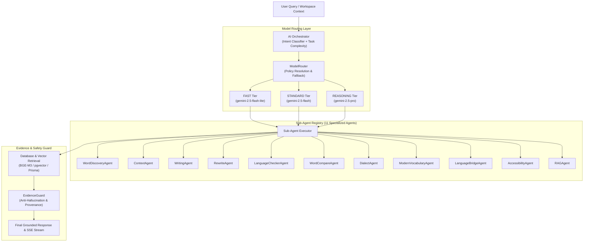

# 🤖 THAI CONTEXT — Gemini Model Routing & Sub-Agent Architecture
> **Module 13:** Production-Grade Model Routing, Dynamic Complexity Resolution, Evidence Guard & Sub-Agent Orchestration

---

## 1. Executive Summary

In **THAI CONTEXT**, AI sub-agents do not hard-code Gemini model IDs. Instead, business logic requests an abstract **`ModelTier`** (`FAST`, `STANDARD`, `REASONING`), and a centralized **`ModelRouter`** maps requests to configured models with automated transient error retries, graceful fallback escalation, telemetry tracking, and strict fact-grounding via **`EvidenceGuard`**.

Retrieved dictionary facts from the Royal Society Dictionary (พจนานุกรม ฉบับราชบัณฑิตยสถาน) and verified dialect corpora are strictly maintained as the **Source of Truth**; AI never fabricates dictionary definitions, dialect terms, or unverified accessibility representations.

---

## 2. Core Architecture Topology



---

## 3. Model Tiers & Configuration

### 3.1 Model Tiers (`ModelTier`)
* **`FAST`** (`gemini-2.5-flash-lite`): Low-latency simple transformations, text shortening, and basic conversational navigation.
* **`STANDARD`** (`gemini-2.5-flash`): Default tier for core linguistic discovery, context analysis, hybrid language checking, and grounded RAG synthesis.
* **`REASONING`** (`gemini-2.5-pro`): Complex multi-word comparative nuance (e.g. *ประสิทธิภาพ* vs *ประสิทธิผล* in academic reports), long-form composition, and historical evolution.

### 3.2 Centralized Environment Configuration
All model IDs, timeouts, and pricing are environment-driven:

```env
# Gemini Models
GEMINI_FAST_MODEL=gemini-2.5-flash-lite
GEMINI_STANDARD_MODEL=gemini-2.5-flash
GEMINI_REASONING_MODEL=gemini-2.5-pro

# Execution Policy
GEMINI_MAX_RETRIES=3
GEMINI_TIMEOUT_MS=30000
GEMINI_TEMPERATURE_DEFAULT=0.2
GEMINI_ENABLE_FALLBACK=true

# Token Pricing Configuration (USD per token)
GEMINI_FAST_INPUT_PRICE=0.000000075
GEMINI_FAST_OUTPUT_PRICE=0.0000003
GEMINI_STANDARD_INPUT_PRICE=0.00000015
GEMINI_STANDARD_OUTPUT_PRICE=0.0000006
GEMINI_REASONING_INPUT_PRICE=0.00000125
GEMINI_REASONING_OUTPUT_PRICE=0.000005
```

---

## 4. Controlled Retries & Fallback Strategy

### 4.1 Retry Strategy
* **Retryable Transient Errors**: `429` (Quota / Rate limit), `500`, `502`, `503`, `504`, network timeouts (`ECONNABORTED`, `ETIMEDOUT`).
* **Non-Retryable Errors**: `400` (Invalid Request / Bad Schema), `401` (Unauthorized), `403` (Forbidden). Thrown immediately without retrying.
* **Backoff**: Exponential backoff with jitter: $Delay = \min(4000, 500 \times 2^{\text{attempt}}) + \text{jitter}(0-200\text{ms})$.

### 4.2 Fallback Escalation
When a model encounters a transient failure or rate limit, the router gracefully escalates according to the configured `fallbackTier`:
$$\text{FAST} \xrightarrow{\text{429/503/timeout}} \text{STANDARD} \xrightarrow{\text{429/503/timeout}} \text{REASONING}$$

Fallback events are logged in structured JSON without exposing secrets:
```json
{
  "event": "model_fallback",
  "agent": "WORD_COMPARE",
  "from": "FAST",
  "to": "STANDARD",
  "reason": "RATE_LIMIT"
}
```

---

## 5. Sub-Agent Directory & Execution Policy

All sub-agents implement the [`SubAgent`](file:///Users/mac/Desktop/workspace/thai-context/apps/api/src/modules/ai/agents/base/agent.interface.ts) interface and are registered in [`CentralAgentRegistry`](file:///Users/mac/Desktop/workspace/thai-context/apps/api/src/modules/ai/agents/agent.registry.ts):

| Sub-Agent | Default Tier | Dynamic Escalation | Core Pipeline / Responsibilities |
| :--- | :--- | :--- | :--- |
| **`WordDiscoveryAgent`** | `STANDARD` | — | Hybrid BGE-M3 / pgvector candidate extraction $\rightarrow$ LLM ranking and explanation. |
| **`ContextAgent`** | `STANDARD` | — | Determines tone, register (`academic`, `business`, `government`, `casual`), audience, and domain. |
| **`WritingAgent`** | `STANDARD` | $\rightarrow$ `REASONING` | Generates grounded sentences/paragraphs. Escalates on academic/research constraints. |
| **`RewriteAgent`** | `STANDARD` | $\rightarrow$ `FAST` | Shortens or formalizes phrasing. Uses `FAST` for simple shortening. |
| **`LanguageCheckerAgent`** | `STANDARD` | — | Hybrid rule engine (`STATIC_GRAMMAR_RULES`) + LLM for redundancy and awkward calques. |
| **`WordCompareAgent`** | `STANDARD` | $\rightarrow$ `REASONING` | Contrasts nuances, emphasis, and usage guidance. Escalates on multi-word/research comparisons. |
| **`DialectAgent`** | `STANDARD` | — | Verified dialect database retrieval $\rightarrow$ LLM synthesis. Never fabricates dialect words. |
| **`ModernVocabularyAgent`** | `STANDARD` | — | Distinguishes `OFFICIAL`, `MODERN`, `EXTERNAL`, and `AI_INFERRED` terms. |
| **`LanguageBridgeAgent`** | `STANDARD` | — | Cross-cultural Thai-English nuances, RTGS transliteration, and IPA pronunciation. |
| **`AccessibilityAgent`** | `FAST` | — | Deterministic Braille mapping + verified TSL 3D gesture database. LLM only for guidance. |
| **`RAGAgent`** | `STANDARD` | — | Top-K retrieval, deduplication, and evidence filtering against Royal Society editions. |

---

## 6. Strict Evidence Guard & Safe Abstention

The [`EvidenceGuard`](file:///Users/mac/Desktop/workspace/thai-context/apps/api/src/modules/ai/evidence/evidence-guard.service.ts) ensures that official dictionary data remains authoritative:
1. **Fact Grounding Check**: If the query asks for non-existent entities, gibberish, or words with 0 retrieved evidence, the system performs **Safe Abstention**:
   > *"ไม่พบข้อมูลที่เพียงพอจากแหล่งข้อมูลพจนานุกรมที่ระบบรองรับ เพื่อป้องกันความคลาดเคลื่อนทางภาษา ระบบจึงไม่สามารถให้ข้อสรุปสำหรับคำดังกล่าวได้"*
2. **Prompt Injection Defense**: Retrieved dictionary citations are treated strictly as **DATA**, filtering out instructions like `Ignore previous instructions` or `System prompt:`.
3. **Dialect Grounding**: Prevents generating fictitious regional dialects or provinces not present in the verified dialect database.
4. **Deterministic Accessibility**: Braille translation is strictly performed via standardized code tables (`THAI_BRAILLE_MAP`); unverified sign language avatars are never presented as official.

---

## 7. Telemetry & Cost Tracking

The [`AITelemetryService`](file:///Users/mac/Desktop/workspace/thai-context/apps/api/src/modules/ai/telemetry/ai-telemetry.service.ts) logs execution metrics for observability without exposing API keys or credentials:
```json
{
  "requestId": "req-1726744800000",
  "agent": "WORD_COMPARE",
  "tier": "REASONING",
  "model": "gemini-2.5-pro",
  "latencyMs": 1420,
  "inputTokens": 350,
  "outputTokens": 180,
  "totalTokens": 530,
  "retryCount": 0,
  "fallback": false,
  "estimatedCost": 0.0013375
}
```

---

## 8. API Endpoints

| Method | Endpoint | Description |
| :--- | :--- | :--- |
| `GET` | `/api/v1/ai/models` | List active model tier policies and current Gemini configuration |
| `GET` | `/api/v1/ai/telemetry` | View token usage, latencies, error counts, and cost breakdown |
| `POST` | `/api/v1/ai/admin/override` | Set administrative model tier overrides (global or per-agent) |
| `DELETE` | `/api/v1/ai/admin/override` | Clear all administrative overrides |
| `POST` | `/api/v1/ai/orchestrator` | Execute multi-agent orchestration with Evidence Guard |
| `POST` | `/api/v1/ai/orchestrator/stream` | Stream orchestration events (`agent.started`, `retrieval.completed`, `evidence.validated`, `generation.delta`, `generation.completed`) |
