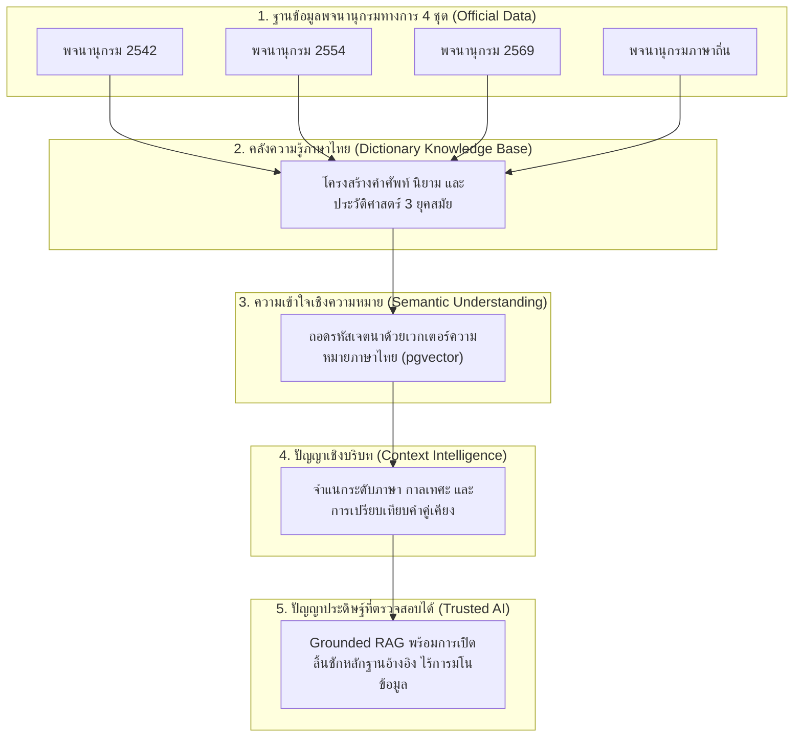
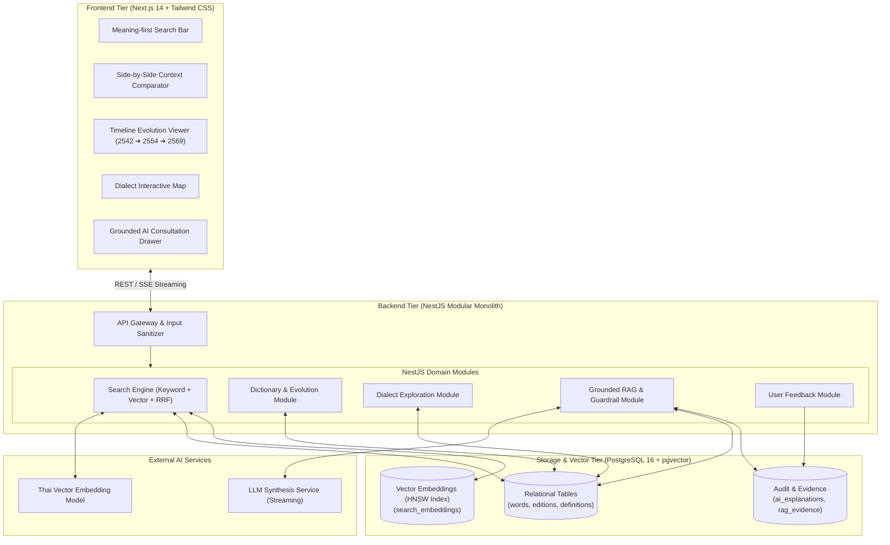
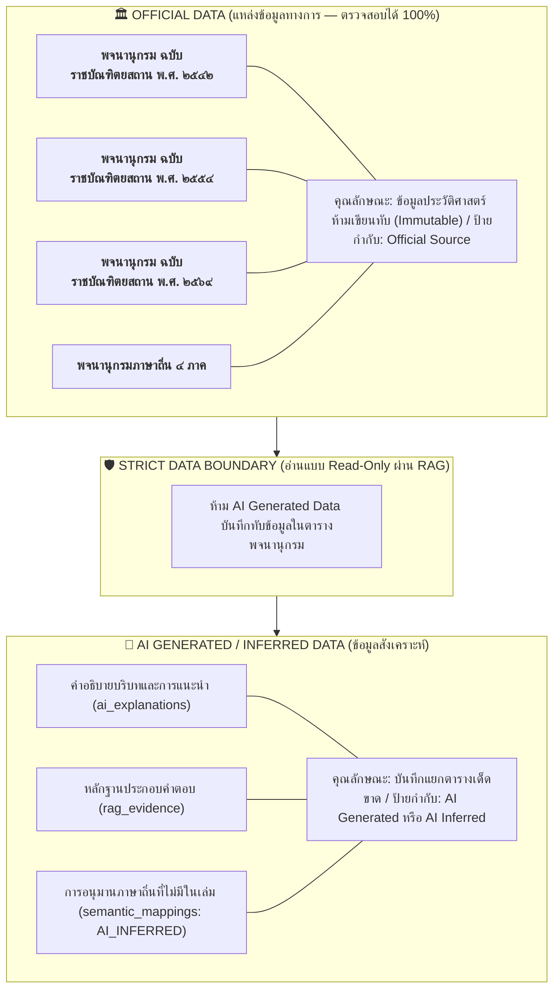

# 🇹🇭 THAI CONTEXT — Master Product Requirements Document (PRD) & Technical Specification
> **"ไม่ต้องรู้คำ ก็รู้ว่าควรใช้คำไหน"**  
> *Semantic Thai Language Exploration Platform for Contextual Word Discovery, Lexical Evolution & Grounded AI*

---

## 📌 Document Overview

| Attribute | Specification |
| :--- | :--- |
| **Project Name** | **THAI CONTEXT (ไทย คอนเท็กซ์)** |
| **Document Type** | Master PRD / SRS / System Architecture / Database Blueprint |
| **Version** | `1.0.0 (Final Comprehensive Master Release)` |
| **Status** | **Approved & Synchronized with All Sub-modules** |
| **Primary Datasets** | พจนานุกรมฉบับราชบัณฑิตยสถาน พ.ศ. 2542, 2554, 2569 และพจนานุกรมภาษาถิ่น 4 ภาค |
| **Core Tech Stack** | Next.js 14, React, Tailwind CSS, NestJS (TypeScript), PostgreSQL 16 (`pgvector`), Docker |

---

# 1. Executive Summary & Product Objective

### 1.1 The Paradigm Shift (การเปลี่ยนผ่านวิธีคิด)
พจนานุกรมแบบดั้งเดิมมีข้อจำกัดเชิงโครงสร้างคือ **"ต้องรู้คำศัพท์ก่อน ถึงจะเปิดหาความหมายได้" (Keyword-first limitation)**  
**THAI CONTEXT** ปรับเปลี่ยนวิธีคิดใหม่ทั้งหมดสู่ **"Meaning-first & Context-aware Discovery"**:

```
Traditional Dictionary:
User knows a word ──► Search headword ──► Read definition

THAI CONTEXT:
User knows what they want to communicate
      ↓
Describe meaning / intent / context
      ↓
Semantic Vector Search (pgvector)
      ↓
Context-aware Ranking
      ↓
Recommended Thai words
      ↓
Understand meaning & registers
      ↓
Side-by-Side Context Compare
      ↓
Explore dictionary evolution (2542 ➔ 2554 ➔ 2569)
      ↓
Explore Thai dialects (North, Northeast, South)
      ↓
Ask AI Assistant in deep context
      ↓
Receive grounded explanation with verifiable evidence
```

> **คำแถลงวิสัยทัศน์หลัก (Core Statement):**  
> *"เราไม่ได้สร้างพจนานุกรมใหม่ แต่เราออกแบบวิธีใหม่ในการเข้าถึง เข้าใจ เปรียบเทียบ และเชื่อมโยงคลังคำภาษาไทย"*

---

# 2. Provided Datasets & Linguistic Integrity

ระบบได้รับการออกแบบให้ใช้และให้เกียรติชุดข้อมูลทางการ 4 ชุดหลัก:
1. **พจนานุกรม ฉบับราชบัณฑิตยสถาน พ.ศ. ๒๕๔๒** (พิมพ์ครั้งแรกในรูปแบบอิเล็กทรอนิกส์ยุคแรก)
2. **พจนานุกรม ฉบับราชบัณฑิตยสถาน พ.ศ. ๒๕๕๔** (ฉบับปรับปรุงครั้งสำคัญ)
3. **พจนานุกรม ฉบับราชบัณฑิตยสถาน พ.ศ. ๒๕๖๙** (ฉบับดิจิทัลล่าสุด)
4. **พจนานุกรมภาษาถิ่น ๔ ภาค** (เหนือ, ตะวันออกเฉียงเหนือ, ใต้, กลาง)

### หลักการจัดเก็บข้อมูล (Data Preservation Principle)
- **Immutable Historical Data:** ข้อมูลของปี 2542 และ 2554 จะไม่มีการเขียนทับโดยเด็ดขาด เพื่อรักษาร่องรอยทางภาษาศาสตร์
- **Strict Data Separation:** แยกข้อมูลทางการ (Official Source) ออกจากข้อมูลที่ AI สังเคราะห์ขึ้น (AI Generated / AI Inferred)

---

# 3. 4 Core Innovation Pillars (4 เสาหลักนวัตกรรม)



| Pillar | นวัตกรรมหลัก | คำอธิบายคุณค่า |
| :---: | :--- | :--- |
| **01** | **Search by Meaning** | **ไม่ต้องรู้คำ ก็ค้นพบคำได้** — ค้นหาด้วยความหมายหรือคำบรรยายสถานการณ์ ระบบถอดรหัสเจตนาด้วย Vector Embeddings |
| **02** | **Search by Context** | **แนะนำคำที่เหมาะกับบริบท** — คัดกรองคำตามระดับภาษา (Register), โทน (Tone), และความเหมาะสมของสถานการณ์ |
| **03** | **Explore Language Evolution & Dialect** | **เห็นพลวัตของภาษาไทย** — ติดตามการเกิดใหม่ ความหมายที่เปลี่ยน และการคงอยู่ของคำจาก 2542 → 2554 → 2569 พร้อมสะพานเชื่อมสู่ภาษาถิ่น |
| **04** | **Trusted & Grounded AI** | **AI ไม่แทนที่พจนานุกรม แต่เป็นสะพานเชื่อม** — ทุกคำตอบถูกตรึง (Grounded) ด้วยข้อมูลจากราชบัณฑิตยสถาน พร้อมแสดง Citation ชัดเจน และมีระบบ Fallback เมื่อไม่มีข้อมูล |

---

# 4. 8 Key Features Matrix

| # | Key Feature | จุดขายเด่น (Value Proposition) | Module | Priority |
| :---: | :--- | :--- | :---: | :---: |
| **01** | **Meaning-first Search** | ไม่รู้คำก็ค้นได้ เพียงบอกสิ่งที่ต้องการสื่อ | Module A | `P0 (Critical)` |
| **02** | **Semantic Search** | ค้นหาจากความหมายเชิงลึก (Concept/Essence) ไม่จำกัดที่ตัวอักษร | Module A | `P0 (Critical)` |
| **03** | **Context-aware Recommendation** | แนะนำคำที่เข้ากับบริบท กาลเทศะ และระดับภาษา | Module B | `P0 (Critical)` |
| **04** | **Dictionary Evolution** | เห็นวิวัฒนาการของคำข้ามกาลเวลา 2542 → 2554 → 2569 | Module C | `P0 (Critical)` |
| **05** | **Dictionary Change Detection** | ตรวจจับการเปลี่ยนแปลง (เพิ่ม/แก้/คงเดิม/ตัดออก) แบบ Semantic Diff | Module C | `P0 (Critical)` |
| **06** | **Dialect Explorer** | สำรวจความรุ่มรวยของภาษาถิ่นไทย (เหนือ, ใต้, อีสาน) เชื่อมสู่ภาษากลาง | Module D | `P0 (Critical)` |
| **07** | **Context Compare & Usage Guidance** | เปรียบเทียบความแตกต่างระหว่างคำใกล้เคียง พร้อมไกด์ไลน์การนำไปใช้ | Module E | `P0 (Critical)` |
| **08** | **Trusted AI + RAG + Evidence** | AI อธิบายกระจ่าง อ้างอิงเล่มและปีพิมพ์ ไร้การมโนข้อมูล | Module F | `P0 (Critical)` |

---

# 5. Detailed Functional Requirements (18 FRs)

### 🔎 Module A — Intelligent Search
- **FR-01: Keyword Search `[P1]`** — ค้นหาด้วย Keyword แบบคำเต็ม, คำบางส่วน, และคำสะกดผิด ผ่าน Trigram Index ตอบสนองภายใน 150ms
- **FR-02: Meaning-first Search `[P0]`** — ค้นหาคำจากประโยคอธิบายความหมายโดยไม่ต้องพิมพ์ตัวคำศัพท์
- **FR-03: Semantic Search `[P0]`** — แปลงประโยคเป็นเวกเตอร์และคำนวณ Cosine Distance บน `pgvector`
- **FR-04: Query Understanding `[P0]`** — ถอดรหัสเจตนา แยกบริบทแวดล้อม และสกัด Negative Constraints (คำที่ต้องการหลีกเลี่ยง)

### 🎯 Module B — Context Recommendation
- **FR-05: Context-aware Recommendation `[P0]`** — จัดอันดับคำด้วยน้ำหนัก: Semantic Similarity + Context Relevance + Evidence
- **FR-06: Explain Recommendation `[P0]`** — ชี้แจงเหตุผลว่าทำไมถึงแนะนำคำนี้ พร้อมแสดงหลักฐานนิยามจากพจนานุกรม

### 📚 Module C — Dictionary Intelligence
- **FR-07: Word Detail `[P0]`** — แสดงโครงสร้างคำศัพท์ครบถ้วน: คำอ่าน, ชนิดของคำ (POS), นิยามตามลำดับข้อ, ตัวอย่างประโยค
- **FR-08: Multi-Version Dictionary `[P0]`** — จัดเก็บและสืบค้นแยกตาม Edition 2542, 2554, 2569 และภาษาถิ่น
- **FR-09: Dictionary Evolution `[P0]`** — แสดงเส้นทางประวัติศาสตร์คำศัพท์ผ่าน Timeline จากปี 2542 $\rightarrow$ 2554 $\rightarrow$ 2569
- **FR-10: Dictionary Change Detection `[P0]`** — ระบุสถานะความเปลี่ยนแปลงระหว่างยุค: Added, Modified, Unchanged, Deprecated

### 🌏 Module D — Thai Language Exploration
- **FR-11: Dialect Explorer `[P0]`** — ค้นหาและสำรวจคำจากพจนานุกรมภาษาถิ่น 4 ภาค พร้อมคำอ่านสำเนียงท้องถิ่นและบริบทวัฒนธรรม
- **FR-12: Standard ↔ Dialect Mapping `[P0]`** — เชื่อมโยงคู่คำระหว่างภาษากลางและภาษาถิ่น โดยระบุป้ายกำกับชัดเจนระหว่าง `OFFICIAL_DATA` กับ `AI_INFERRED`

### ⚖️ Module E — Compare & Usage
- **FR-13: Context Compare `[P0]`** — เปรียบเทียบคำที่มีความหมายใกล้เคียงกันแบบ Side-by-Side ในมิตินิยาม บริบท และข้อพึงระวัง
- **FR-14: Usage Guidance `[P0]`** — สรุปคำแนะนำการใช้งานและระดับภาษา (ทางการ, กึ่งทางการ, ปากเปล่า)

### 🤖 Module F — Trusted AI
- **FR-15: RAG-based AI Assistant `[P0]`** — ผู้ช่วย AI สังเคราะห์คำตอบโดยใช้เฉพาะข้อมูลที่ดึงจากพจนานุกรมมาเป็น Context
- **FR-16: Source & Evidence `[P0]`** — ทุกคำตอบของ AI ต้องแนบการ์ดระบุเล่มพจนานุกรม ปี พ.ศ. และข้อความนิยามต้นฉบับ
- **FR-17: Hallucination Guard `[P0]`** — มี Threshold Guard ปฏิเสธการตอบ (Abstention) เมื่อผลการค้นหาไม่พบข้อมูลที่น่าเชื่อถือ

### 📊 Module G — Feedback
- **FR-18: Search Feedback `[P1]`** — จัดเก็บ Log การคลิกและคะแนนประเมินของผู้ใช้เพื่อนำมาปรับจูน Ranking Engine

---

# 6. Non-Functional Requirements (12 NFRs)

| ID | มิติ NFR | มาตรฐานและเกณฑ์การยอมรับ (Acceptance Criteria) |
| :--- | :--- | :--- |
| **NFR-01** | **Language Accuracy** | ข้อมูลคำนิยามต้องตรงกับชุดข้อมูลทางการ 100% ไร้การตัดทอนหรือบิดเบือน |
| **NFR-02** | **AI Grounding** | คำตอบของโมเดลต้องถูกควบคุม (Constrained) ให้อ้างอิงเฉพาะระเบียนพจนานุกรมที่ได้รับ |
| **NFR-03** | **Traceability** | ทุกการแสดงผลต้องสืบย้อนแหล่งที่มา (Source, Edition, Section) ได้เสมอ |
| **NFR-04** | **Anti-Hallucination** | มี Threshold Guard ปฏิเสธการตอบเมื่อหลักฐานไม่เพียงพอ |
| **NFR-05** | **Performance** | Search P95 < 250ms, LLM Streaming First Token (TTFT) < 800ms |
| **NFR-06** | **Usability** | ใช้งานได้ง่าย ผู้ใช้ทั่วไปค้นพบคำได้ภายใน 3 คลิก โดยไม่ต้องเข้าใจคำสั่ง Prompt |
| **NFR-07** | **Accessibility** | Responsive Design, รองรับ Thai Typography ที่อ่านง่าย, ได้มาตรฐาน WCAG 2.1 AA |
| **NFR-08** | **Scalability** | รองรับการเพิ่ม Dataset ฉบับใหม่ผ่าน Ingestion Pipeline โดยไม่ต้องแก้ Core Logic |
| **NFR-09** | **Maintainability** | ออกแบบโครงสร้างแบบ Modular Monolith แยกเลเยอร์ชัดเจน สะดวกต่อการพัฒนาและส่งมอบ |
| **NFR-10** | **Security** | ป้องกัน Prompt Injection, Input Sanitization ป้องกัน XSS/SQL Injection, จัดเก็บ API Key ใน Secret Manager |
| **NFR-11** | **Data Governance** | เคารพเงื่อนไขการใช้ข้อมูลของราชบัณฑิตยสถานและสถาบันภาษาถิ่นอย่างเคร่งครัด |
| **NFR-12** | **Extensibility** | โครงสร้างระบบพร้อมเปิดเป็น Thai Semantic Lexicon API สำหรับต่อยอดในอนาคต |

---

# 7. Complete Requirement Traceability Matrix

| Problem | Feature | FR | Component | Database Entity | API Endpoint | UI Component | User Value |
| :--- | :--- | :--- | :--- | :--- | :--- | :--- | :--- |
| จำคำได้ลางๆ | Keyword Search | **FR-01** | `TrigramMatcher` | `words`, `word_entries` | `GET /search/keyword` | Autocomplete Bar | ตรวจสอบตัวสะกดได้รวดเร็ว |
| นึกคำไม่ออก | Meaning Search | **FR-02** | `EmbeddingService` | `words`, `definitions`, `search_embeddings` | `POST /search/meaning` | Meaning Input Box | ค้นพบคำจากเจตนาในใจ |
| ตัวอักษรไม่ตรง | Semantic Search | **FR-03** | `PgVectorEngine` | `search_embeddings` | `POST /search/vector` | Match Result Cards | เข้าถึงคำผ่านแก่นความหมาย |
| มีคำที่ไม่อยากได้ | Query Understand | **FR-04** | `IntentAnalyzer` | `search_embeddings`, `definitions` | `POST /search/intent` | Smart Query Filter | คัดกรองคำต้องห้ามอัตโนมัติ |
| ลังเลกาลเทศะ | Context Rank | **FR-05** | `ContextRanker` | `word_entries`, `definitions` | `POST /recommend/context` | Ranked Badges (%) | เลือกคำได้เหมาะกับผู้รับสาร |
| สงสัยเหตุผล | Explain Word | **FR-06** | `ReasoningEngine` | `definitions`, `dictionary_editions` | `GET /recommend/{id}/why`| Explanation Drawer | มั่นใจด้วยเหตุผลจากนิยามจริง |
| รายละเอียดคำ | Word Detail | **FR-07** | `LexiconService` | `word_entries`, `definitions`, `parts_of_speech` | `GET /words/{word}/detail` | Word Detail Card | เห็นคำอ่าน ชนิดคำ ตัวอย่าง |
| สับสนปีพิมพ์ | Multi-Version | **FR-08** | `EditionManager` | `dictionary_sources`, `dictionary_editions` | `GET /editions` | Edition Switcher | เช็กปีพิมพ์และที่มาได้ชัดเจน |
| ไม่เห็นพลวัต | Dict Evolution | **FR-09** | `EvolutionTracker` | `words`, `word_entries`, `dictionary_editions` | `GET /words/{word}/evolution`| Time-Travel Slider | เห็นพัฒนาการคำ 27 ปี |
| อ่านเทียบยาก | Change Detect | **FR-10** | `SemanticDiffEngine` | `word_entries`, `definitions` | `GET /words/{word}/diff` | Diff Badges (🟢, 🟡) | รู้จุดเพิ่ม/แก้นิยามทันที |
| หาภาษาถิ่นยาก | Dialect Explorer | **FR-11** | `DialectService` | `dialect_regions`, `dialect_entries` | `GET /dialects/explore` | Regional Dialect Map | สัมผัสความหลากหลายทางภาษา |
| แมปภาษากลาง | Dialect Mapping | **FR-12** | `LanguageMapper` | `semantic_mappings` | `GET /words/{word}/dialect` | Equivalence Badge | สื่อสารข้ามวัฒนธรรมได้แม่นยำ |
| สับสนคำคู่แฝด | Context Compare | **FR-13** | `ComparisonMatrix` | `word_entries`, `definitions` | `POST /words/compare` | Side-by-Side Matrix | ตัดสินใจเลือกคำคู่แฝดได้ง่าย |
| กลัวใช้ผิดระดับ | Usage Guidance | **FR-14** | `RegisterAdvisor` | `definitions`, `ai_explanations` | `GET /words/{word}/usage` | Register Level Tag | สื่อสารได้ถูกต้องตามกาลเทศะ |
| ต้องการคำปรึกษา | Grounded AI | **FR-15** | `GroundedRAGEngine` | `search_embeddings`, `ai_explanations` | `POST /ai/consult` | AI Writing Drawer | ได้รับคำแนะนำการเรียบเรียง |
| กลัว AI มโน | Source Evidence | **FR-16** | `EvidenceTracker` | `rag_evidence`, `word_entries` | `GET /ai/evidence/{id}` | Citation Card & Link | ตรวจสอบที่มาถึงหน้าหนังสือ |
| ป้องกันข้อมูลเท็จ | Hallucination Guard | **FR-17** | `AbstentionGuard` | `search_embeddings` (Threshold) | `POST /ai/consult` (Fallback)| Fallback Alert Message | ปลอดภัยจากคำตอบที่ไม่มีข้อมูล |
| ต้องการปรับปรุง | Search Feedback | **FR-18** | `FeedbackService` | `search_feedback` | `POST /feedback` | Thumbs Up/Down Rating | ร่วมพัฒนาระบบค้นหาให้ฉลาดขึ้น |

---

# 8. Technical Architecture & Schemas

### 8.1 System Topology (Mermaid)



### 8.2 Official Data vs. AI-Generated Data Separation



---

# 9. Complete Production PostgreSQL DDL & Seed Data

```sql
-- ============================================================================
-- THAI CONTEXT: Master DDL Schema & Sample Seed Data
-- ============================================================================

CREATE EXTENSION IF NOT EXISTS "uuid-ossp";
CREATE EXTENSION IF NOT EXISTS "pg_trgm";
CREATE EXTENSION IF NOT EXISTS "vector";

-- 1. SOURCES & EDITIONS
CREATE TABLE dictionary_sources (
    id UUID PRIMARY KEY DEFAULT uuid_generate_v4(),
    code VARCHAR(50) NOT NULL UNIQUE,
    name VARCHAR(255) NOT NULL,
    publisher VARCHAR(255) NOT NULL,
    description TEXT,
    created_at TIMESTAMP WITH TIME ZONE DEFAULT NOW(),
    updated_at TIMESTAMP WITH TIME ZONE DEFAULT NOW()
);

CREATE TABLE dictionary_editions (
    id UUID PRIMARY KEY DEFAULT uuid_generate_v4(),
    source_id UUID NOT NULL REFERENCES dictionary_sources(id) ON DELETE RESTRICT,
    edition_code VARCHAR(50) NOT NULL UNIQUE,
    edition_year VARCHAR(10) NOT NULL,
    title VARCHAR(255) NOT NULL,
    publication_date DATE,
    is_active BOOLEAN NOT NULL DEFAULT TRUE,
    created_at TIMESTAMP WITH TIME ZONE DEFAULT NOW(),
    updated_at TIMESTAMP WITH TIME ZONE DEFAULT NOW()
);

-- 2. CANONICAL WORDS & ENTRIES
CREATE TABLE parts_of_speech (
    id UUID PRIMARY KEY DEFAULT uuid_generate_v4(),
    code VARCHAR(20) NOT NULL UNIQUE,
    abbr_thai VARCHAR(20) NOT NULL UNIQUE,
    name_thai VARCHAR(100) NOT NULL,
    name_english VARCHAR(100),
    created_at TIMESTAMP WITH TIME ZONE DEFAULT NOW()
);

CREATE TABLE words (
    id UUID PRIMARY KEY DEFAULT uuid_generate_v4(),
    headword VARCHAR(255) NOT NULL UNIQUE,
    headword_clean VARCHAR(255) NOT NULL,
    char_length INT NOT NULL,
    created_at TIMESTAMP WITH TIME ZONE DEFAULT NOW()
);

CREATE TABLE word_entries (
    id UUID PRIMARY KEY DEFAULT uuid_generate_v4(),
    word_id UUID NOT NULL REFERENCES words(id) ON DELETE CASCADE,
    edition_id UUID NOT NULL REFERENCES dictionary_editions(id) ON DELETE RESTRICT,
    pronunciation VARCHAR(255),
    royal_sequence INT,
    page_number INT,
    metadata JSONB DEFAULT '{}'::jsonb,
    created_at TIMESTAMP WITH TIME ZONE DEFAULT NOW(),
    updated_at TIMESTAMP WITH TIME ZONE DEFAULT NOW(),
    CONSTRAINT uq_word_edition UNIQUE (word_id, edition_id)
);

CREATE TABLE definitions (
    id UUID PRIMARY KEY DEFAULT uuid_generate_v4(),
    entry_id UUID NOT NULL REFERENCES word_entries(id) ON DELETE CASCADE,
    pos_id UUID REFERENCES parts_of_speech(id) ON DELETE SET NULL,
    sense_order INT NOT NULL DEFAULT 1,
    definition_text TEXT NOT NULL,
    register_level VARCHAR(50) DEFAULT 'FORMAL',
    subject_domain VARCHAR(100),
    created_at TIMESTAMP WITH TIME ZONE DEFAULT NOW(),
    updated_at TIMESTAMP WITH TIME ZONE DEFAULT NOW(),
    CONSTRAINT uq_entry_sense UNIQUE (entry_id, sense_order)
);

CREATE TABLE examples (
    id UUID PRIMARY KEY DEFAULT uuid_generate_v4(),
    definition_id UUID NOT NULL REFERENCES definitions(id) ON DELETE CASCADE,
    example_text TEXT NOT NULL,
    source_attribution VARCHAR(255),
    created_at TIMESTAMP WITH TIME ZONE DEFAULT NOW()
);

-- 3. DIALECT TABLES
CREATE TABLE dialect_regions (
    id UUID PRIMARY KEY DEFAULT uuid_generate_v4(),
    code VARCHAR(50) NOT NULL UNIQUE,
    name_thai VARCHAR(100) NOT NULL,
    description TEXT,
    created_at TIMESTAMP WITH TIME ZONE DEFAULT NOW()
);

CREATE TABLE dialect_entries (
    id UUID PRIMARY KEY DEFAULT uuid_generate_v4(),
    region_id UUID NOT NULL REFERENCES dialect_regions(id) ON DELETE RESTRICT,
    edition_id UUID NOT NULL REFERENCES dictionary_editions(id) ON DELETE RESTRICT,
    dialect_word VARCHAR(255) NOT NULL,
    dialect_word_clean VARCHAR(255) NOT NULL,
    ipa_phonetic VARCHAR(255),
    local_meaning TEXT NOT NULL,
    cultural_notes TEXT,
    created_at TIMESTAMP WITH TIME ZONE DEFAULT NOW(),
    updated_at TIMESTAMP WITH TIME ZONE DEFAULT NOW()
);

CREATE TABLE semantic_mappings (
    id UUID PRIMARY KEY DEFAULT uuid_generate_v4(),
    standard_entry_id UUID NOT NULL REFERENCES word_entries(id) ON DELETE CASCADE,
    dialect_entry_id UUID NOT NULL REFERENCES dialect_entries(id) ON DELETE CASCADE,
    relationship_type VARCHAR(50) NOT NULL,
    confidence_score NUMERIC(5,4) NOT NULL,
    source_type VARCHAR(50) NOT NULL,
    curated_by VARCHAR(100),
    created_at TIMESTAMP WITH TIME ZONE DEFAULT NOW(),
    CONSTRAINT chk_source_type CHECK (source_type IN ('OFFICIAL_DATA', 'AI_INFERRED')),
    CONSTRAINT uq_std_dialect_map UNIQUE (standard_entry_id, dialect_entry_id)
);

CREATE TABLE word_relationships (
    id UUID PRIMARY KEY DEFAULT uuid_generate_v4(),
    source_word_id UUID NOT NULL REFERENCES words(id) ON DELETE CASCADE,
    target_word_id UUID NOT NULL REFERENCES words(id) ON DELETE CASCADE,
    relationship_type VARCHAR(50) NOT NULL,
    source_type VARCHAR(50) NOT NULL DEFAULT 'OFFICIAL_DATA',
    created_at TIMESTAMP WITH TIME ZONE DEFAULT NOW(),
    CONSTRAINT chk_rel_source CHECK (source_type IN ('OFFICIAL_DATA', 'AI_INFERRED')),
    CONSTRAINT chk_no_self_rel CHECK (source_word_id <> target_word_id)
);

-- 4. VECTOR EMBEDDINGS (pgvector)
-- Configurable Dimension: Default 1536 (OpenAI text-embedding-3-small)
CREATE TABLE search_embeddings (
    id UUID PRIMARY KEY DEFAULT uuid_generate_v4(),
    entity_type VARCHAR(50) NOT NULL,
    entity_id UUID NOT NULL,
    edition_id UUID REFERENCES dictionary_editions(id) ON DELETE CASCADE,
    searchable_text TEXT NOT NULL,
    model_name VARCHAR(100) NOT NULL,
    model_dimension INT NOT NULL DEFAULT 1536,
    embedding vector(1536) NOT NULL,
    created_at TIMESTAMP WITH TIME ZONE DEFAULT NOW(),
    CONSTRAINT chk_entity_type CHECK (entity_type IN ('WORD_ENTRY', 'DEFINITION', 'DIALECT_ENTRY'))
);

-- 5. AI EXPLANATIONS & RAG EVIDENCE
CREATE TABLE ai_explanations (
    id UUID PRIMARY KEY DEFAULT uuid_generate_v4(),
    user_query TEXT NOT NULL,
    explanation_type VARCHAR(50) NOT NULL,
    generated_content TEXT NOT NULL,
    model_identifier VARCHAR(100) NOT NULL,
    temperature NUMERIC(3,2) DEFAULT 0.20,
    created_at TIMESTAMP WITH TIME ZONE DEFAULT NOW()
);

CREATE TABLE rag_evidence (
    id UUID PRIMARY KEY DEFAULT uuid_generate_v4(),
    explanation_id UUID NOT NULL REFERENCES ai_explanations(id) ON DELETE CASCADE,
    entry_id UUID NOT NULL REFERENCES word_entries(id) ON DELETE CASCADE,
    definition_id UUID REFERENCES definitions(id) ON DELETE CASCADE,
    relevance_score NUMERIC(5,4) NOT NULL,
    cited_snippet TEXT NOT NULL,
    created_at TIMESTAMP WITH TIME ZONE DEFAULT NOW()
);

-- 6. USER FEEDBACK
CREATE TABLE search_feedback (
    id UUID PRIMARY KEY DEFAULT uuid_generate_v4(),
    query_text TEXT NOT NULL,
    recommended_word_id UUID REFERENCES words(id) ON DELETE SET NULL,
    user_action VARCHAR(50) NOT NULL,
    rating INT CHECK (rating BETWEEN 1 AND 5),
    feedback_notes TEXT,
    session_id VARCHAR(100),
    created_at TIMESTAMP WITH TIME ZONE DEFAULT NOW()
);

-- 7. INDEXES
CREATE INDEX idx_word_entries_word ON word_entries(word_id);
CREATE INDEX idx_word_entries_edition ON word_entries(edition_id);
CREATE INDEX idx_definitions_entry ON definitions(entry_id);
CREATE INDEX idx_definitions_pos ON definitions(pos_id);
CREATE INDEX idx_words_headword_trgm ON words USING gin (headword gin_trgm_ops);
CREATE INDEX idx_words_clean_trgm ON words USING gin (headword_clean gin_trgm_ops);
CREATE INDEX idx_definitions_text_trgm ON definitions USING gin (definition_text gin_trgm_ops);
CREATE INDEX idx_dialect_word_trgm ON dialect_entries USING gin (dialect_word gin_trgm_ops);

CREATE INDEX idx_search_embeddings_vector_hnsw 
ON search_embeddings 
USING hnsw (embedding vector_cosine_ops)
WITH (m = 16, ef_construction = 64);

CREATE INDEX idx_search_embeddings_lookup ON search_embeddings(entity_type, edition_id);

-- 8. SAMPLE SEED DATA [DEMO / SAMPLE DATA — FOR DEVELOPMENT ONLY]
INSERT INTO dictionary_sources (id, code, name, publisher) VALUES
('11111111-1111-1111-1111-111111111111', 'ROYAL_SOCIETY', 'สำนักงานราชบัณฑิตยสภา', 'สำนักงานราชบัณฑิตยสภา'),
('22222222-2222-2222-2222-222222222222', 'DIALECT_INSTITUTE', 'สถาบันวิจัยภาษาและวัฒนธรรมเอเชีย', 'ศูนย์ศึกษาภาษาถิ่น');

INSERT INTO dictionary_editions (id, source_id, edition_code, edition_year, title, publication_date) VALUES
('aaaaaaaa-aaaa-aaaa-aaaa-aaaaaaaaaaaa', '11111111-1111-1111-1111-111111111111', 'ROYAL_2542', '2542', 'พจนานุกรม ฉบับราชบัณฑิตยสถาน พ.ศ. ๒๕๔๒', '1999-12-01'),
('bbbbbbbb-bbbb-bbbb-bbbb-bbbbbbbbbbbb', '11111111-1111-1111-1111-111111111111', 'ROYAL_2554', '2554', 'พจนานุกรม ฉบับราชบัณฑิตยสถาน พ.ศ. ๒๕๕๔', '2012-04-05'),
('cccccccc-cccc-cccc-cccc-cccccccccccc', '11111111-1111-1111-1111-111111111111', 'ROYAL_2569', '2569', 'พจนานุกรม ฉบับราชบัณฑิตยสถาน พ.ศ. ๒๕๖๙ (ฉบับดิจิทัล)', '2026-01-01'),
('dddddddd-dddd-dddd-dddd-dddddddddddd', '22222222-2222-2222-2222-222222222222', 'DIALECT_THAI', '2565', 'คลังรวบรวมพจนานุกรมภาษาถิ่นไทย ๔ ภาค', '2022-06-15');

INSERT INTO parts_of_speech (id, code, abbr_thai, name_thai, name_english) VALUES
('pos00001-0000-0000-0000-000000000001', 'N', 'น.', 'คำนาม', 'Noun'),
('pos00002-0000-0000-0000-000000000002', 'V', 'ก.', 'คำกริยา', 'Verb'),
('pos00003-0000-0000-0000-000000000003', 'ADJ', 'ว.', 'คำวิเศษณ์', 'Adjective');

INSERT INTO dialect_regions (id, code, name_thai, description) VALUES
('reg00001-0000-0000-0000-000000000001', 'NORTH', 'ภาษาถิ่นเหนือ', 'กลุ่มภาษาล้านนา ภาคเหนือ'),
('reg00002-0000-0000-0000-000000000002', 'NORTHEAST', 'ภาษาถิ่นอีสาน', 'กลุ่มภาษาไทย-ลาว ภาคตะวันออกเฉียงเหนือ'),
('reg00003-0000-0000-0000-000000000003', 'SOUTH', 'ภาษาถิ่นใต้', 'กลุ่มภาษาถิ่น ๑๔ จังหวัดภาคใต้');

INSERT INTO words (id, headword, headword_clean, char_length) VALUES
('w0000001-0000-0000-0000-000000000001', 'ประสิทธิภาพ', 'ประสิทธิภาพ', 11),
('w0000002-0000-0000-0000-000000000002', 'ประสิทธิผล', 'ประสิทธิผล', 10),
('w0000003-0000-0000-0000-000000000003', 'อร่อย', 'อร่อย', 4);

INSERT INTO word_entries (id, word_id, edition_id, pronunciation, page_number) VALUES
('e2542001-0000-0000-0000-000000000001', 'w0000001-0000-0000-0000-000000000001', 'aaaaaaaa-aaaa-aaaa-aaaa-aaaaaaaaaaaa', 'ปฺระ-สิด-ทิ-พาบ', 712),
('e2554001-0000-0000-0000-000000000001', 'w0000001-0000-0000-0000-000000000001', 'bbbbbbbb-bbbb-bbbb-bbbb-bbbbbbbbbbbb', 'ปฺระ-สิด-ทิ-พาบ', 734),
('e2569001-0000-0000-0000-000000000001', 'w0000001-0000-0000-0000-000000000001', 'cccccccc-cccc-cccc-cccc-cccccccccccc', 'ปฺระ-สิด-ทิ-พาบ', 820);

INSERT INTO definitions (id, entry_id, pos_id, sense_order, definition_text, register_level, subject_domain) VALUES
('def42001-0000-0000-0000-000000000001', 'e2542001-0000-0000-0000-000000000001', 'pos00001-0000-0000-0000-000000000001', 1, 
'[SAMPLE DEFINITION — 2542] ความสามารถที่ทำให้เกิดผลสัมฤทธิ์ในการทำงาน', 'FORMAL', 'ทั่วไป'),
('def54001-0000-0000-0000-000000000001', 'e2554001-0000-0000-0000-000000000001', 'pos00001-0000-0000-0000-000000000001', 1, 
'[SAMPLE DEFINITION — 2554] ความสามารถที่ทำให้เกิดผลสัมฤทธิ์ในการปฏิบัติงานโดยใช้ทรัพยากรและเวลาอย่างคุ้มค่าที่สุด', 'FORMAL', 'การบริหาร'),
('def69001-0000-0000-0000-000000000001', 'e2569001-0000-0000-0000-000000000001', 'pos00001-0000-0000-0000-000000000001', 1, 
'[SAMPLE DEFINITION — 2569] ความสามารถในการปฏิบัติการที่ให้ผลลัพธ์สูงสุดโดยสูญเสียทรัพยากร พลังงาน หรือเวลาน้อยที่สุด ครอบคลุมทั้งระบบการทำงานและเทคโนโลยี', 'FORMAL', 'การบริหารและเทคโนโลยี');

INSERT INTO word_entries (id, word_id, edition_id, pronunciation, page_number) VALUES
('e2569003-0000-0000-0000-000000000003', 'w0000003-0000-0000-0000-000000000003', 'cccccccc-cccc-cccc-cccc-cccccccccccc', 'อะ-หฺร่อย', 1420);

INSERT INTO definitions (id, entry_id, pos_id, sense_order, definition_text, register_level) VALUES
('def69003-0000-0000-0000-000000000003', 'e2569003-0000-0000-0000-000000000003', 'pos00003-0000-0000-0000-000000000003', 1,
'[SAMPLE DEFINITION — 2569] มีรสดีเป็นที่ถูกปาก, มีรสชาติถูกอัธยาศัย', 'INFORMAL');

INSERT INTO dialect_entries (id, region_id, edition_id, dialect_word, dialect_word_clean, local_meaning) VALUES
('dia00001-0000-0000-0000-000000000001', 'reg00001-0000-0000-0000-000000000001', 'dddddddd-dddd-dddd-dddd-dddddddddddd', 'ลำ', 'ลำ', '[SAMPLE DIALECT] รสชาติอร่อย มีรสโอชา'),
('dia00002-0000-0000-0000-000000000002', 'reg00002-0000-0000-0000-000000000002', 'dddddddd-dddd-dddd-dddd-dddddddddddd', 'แซ่บ', 'แซบ', '[SAMPLE DIALECT] รสชาติอร่อย เผ็ดนัวถึงใจ'),
('dia00003-0000-0000-0000-000000000003', 'reg00003-0000-0000-0000-000000000003', 'dddddddd-dddd-dddd-dddd-dddddddddddd', 'หรอย', 'หรอย', '[SAMPLE DIALECT] รสชาติอร่อย ได้อารมณ์ สะใจ');

INSERT INTO semantic_mappings (standard_entry_id, dialect_entry_id, relationship_type, confidence_score, source_type, curated_by) VALUES
('e2569003-0000-0000-0000-000000000003', 'dia00001-0000-0000-0000-000000000001', 'EXACT_EQUIVALENT', 1.0000, 'OFFICIAL_DATA', 'พจนานุกรมภาษาถิ่นเปรียบเทียบ'),
('e2569003-0000-0000-0000-000000000003', 'dia00002-0000-0000-0000-000000000002', 'EXACT_EQUIVALENT', 1.0000, 'OFFICIAL_DATA', 'พจนานุกรมภาษาถิ่นเปรียบเทียบ'),
('e2569003-0000-0000-0000-000000000003', 'dia00003-0000-0000-0000-000000000003', 'EXACT_EQUIVALENT', 1.0000, 'OFFICIAL_DATA', 'พจนานุกรมภาษาถิ่นเปรียบเทียบ');

INSERT INTO search_embeddings (entity_type, entity_id, edition_id, searchable_text, model_name, embedding) VALUES
('DEFINITION', 'def69001-0000-0000-0000-000000000001', 'cccccccc-cccc-cccc-cccc-cccccccccccc', 
'ประสิทธิภาพ: ความสามารถในการปฏิบัติการที่ให้ผลลัพธ์สูงสุดโดยสูญเสียทรัพยากร พลังงาน หรือเวลาน้อยที่สุด', 
'text-embedding-3-small', 
array_fill(0.024::float4, ARRAY[1536])::vector);

INSERT INTO ai_explanations (id, user_query, explanation_type, generated_content, model_identifier) VALUES
('exp00001-0000-0000-0000-000000000001', 
'อยากบอกว่าทำงานได้ผลลัพธ์ดีเลิศ ใช้เวลาและงบประมาณอย่างคุ้มค่าที่สุด แต่ไม่อยากใช้คำว่าเร็ว', 
'MEANING_RECOMMEND', 
'ขอแนะนำคำว่า "ประสิทธิภาพ" เนื่องจากนิยามระบุถึงการกระทำที่ส่งผลสัมฤทธิ์โดยใช้ทรัพยากรและเวลาอย่างคุ้มค่า เหมาะกับบริบทการทำงานเชิงบริหาร', 
'gemini-1.5-pro');

INSERT INTO rag_evidence (explanation_id, entry_id, definition_id, relevance_score, cited_snippet) VALUES
('exp00001-0000-0000-0000-000000000001', 
'e2569001-0000-0000-0000-000000000001', 
'def69001-0000-0000-0000-000000000001', 
0.9420, 
'พจนานุกรม ฉบับราชบัณฑิตยสถาน พ.ศ. ๒๕๖๙: "ความสามารถในการปฏิบัติการที่ให้ผลลัพธ์สูงสุดโดยสูญเสียทรัพยากร..."');
```

---

# 10. The 10-Step Continuous Hackathon Demo Story

```mermaid
flowchart TD
    D1["<b>Step 1: ผู้ใช้ป้อนเจตนาเป็นภาษาธรรมชาติ</b><br/>'อยากบอกว่าทำงานได้ผลลัพธ์ดีเลิศ คุ้มค่าทรัพยากร แต่ไม่อยากใช้คำว่าเร็ว'<br/><i>(FR-02 Meaning-first Search)</i>"] -->
    D2["<b>Step 2: ระบบถอดรหัสความหมายและเงื่อนไข</b><br/>ตัดคำว่า 'เร็ว' ออก และวิเคราะห์แก่นความหมายของการทำงานเชิงบริหาร<br/><i>(FR-04 Query Understanding)</i>"] -->
    D3["<b>Step 3: แนะนำคำศัพท์ที่เหมาะสมที่สุด</b><br/>แสดงคำว่า 'ประสิทธิภาพ' (94%) พร้อมอธิบายเหตุผลจากนิยาม<br/><i>(FR-03 Semantic Search, FR-05 Context Recommendation, FR-06 Explain)</i>"] -->
    D4["<b>Step 4: ผู้ใช้กดเปรียบเทียบสองคำที่ลังเล</b><br/>เปรียบเทียบ 'ประสิทธิภาพ' (กระบวนการคุ้มค่า) vs 'ประสิทธิผล' (ผลลัพธ์ตรงเป้า)<br/><i>(FR-13 Context Compare)</i>"] -->
    D5["<b>Step 5: ตรวจสอบระดับภาษาและคำแนะนำการใช้</b><br/>ดูแท็กระดับภาษาทางการ (Formal) และตัวอย่างการใช้ในเอกสารราชการ<br/><i>(FR-07 Word Detail, FR-14 Usage Guidance)</i>"] -->
    D6["<b>Step 6: ท่องเวลากับวิวัฒนาการพจนานุกรม 3 ยุค</b><br/>กดดูแถบ Timeline ปี 2542 ➔ 2554 ➔ 2569 ของคำว่า 'ประสิทธิภาพ'<br/><i>(FR-08 Multi-Version Dictionary, FR-09 Dictionary Evolution)</i>"] -->
    D7["<b>Step 7: แสดงจุดที่มีการเปลี่ยนแปลงความหมาย (Semantic Diff)</b><br/>ระบบไฮไลต์แท็กสีเหลือง 'ปรับปรุงนิยามในฉบับ 2554 และ 2569 ครอบคลุมเทคโนโลยี'<br/><i>(FR-10 Dictionary Change Detection)</i>"] -->
    D8["<b>Step 8: สำรวจคำเทียบเคียงในภาษาถิ่น</b><br/>กดดูคำที่มีนัยยะความคล่องแคล่วและการทำงานได้ดีในภาษาเหนือ/อีสาน/ใต้<br/><i>(FR-11 Dialect Explorer, FR-12 Standard ↔ Dialect Mapping)</i>"] -->
    D9["<b>Step 9: ปรึกษาผู้ช่วย AI ด้านการนำไปเขียนงานจริง</b><br/>ถาม: 'ถ้าจะนำคำนี้ไปเขียนในรายงานประเมินผลประจำปี ควรเขียนอย่างไร?'<br/><i>(FR-15 RAG-based AI Assistant, FR-17 Hallucination Guard)</i>"] -->
    D10["<b>Step 10: AI ให้คำตอบพร้อมเปิด Drawer แสดงหลักฐาน</b><br/>AI แนะนำรูปประโยค พร้อมการ์ดอ้างอิงพจนานุกรมฉบับ 2569 หน้า 820 อย่างโปร่งใส<br/><i>(FR-16 Source & Evidence, FR-18 Search Feedback)</i>"]
```



---

# 11. Hackathon Scoring Rubric Alignment (100%)

| เกณฑ์คะแนน | สัดส่วน | ฟีเจอร์ที่ THAI CONTEXT นำมาตอบโจทย์ | คุณค่าที่ส่งมอบให้ผู้ใช้งาน |
| :--- | :---: | :--- | :--- |
| **1. Problem Fit & Alignment** | **25%** | Meaning-first Search + Context Recommendation | พลิกโฉมการค้นหาพจนานุกรม ช่วยให้ผู้ใช้ค้นพบคำที่ถูกต้องได้โดยเริ่มจากความหมายในใจ |
| **2. Language Accuracy** | **15%** | Multi-Version Official Dictionary + Strict Grounded RAG | รวบรวมข้อมูลจากราชบัณฑิตยสถาน 3 ยุคและภาษาถิ่นอย่างถูกต้อง ไร้การดัดแปลงนิยาม |
| **3. Innovation & Creativity** | **20%** | Semantic Vector Search + Evolution Timeline + Dialect Mapping | สร้างสะพานเชื่อมระหว่างความหมาย วิวัฒนาการคำข้าม 27 ปี และภาษาถิ่นอย่างที่ไม่เคยมีมาก่อน |
| **4. Technical Feasibility** | **15%** | Modular Monolith (NestJS + Next.js + PostgreSQL/pgvector) | ทำงานได้จริง Latency ต่ำ มีความเสถียรสูง และไม่ซับซ้อนเกินจำเป็นสำหรับ Hackathon |
| **5. UX/UI & User Experience** | **15%** | 3-Click Discovery Journey + Side-by-Side Comparator | ออกแบบหน้าตาให้เรียบหรู ใช้งานง่าย ผู้ใช้ทั่วไปเข้าถึงคำตอบได้โดยไม่ต้องเข้าใจเรื่อง Prompt |
| **6. Scalability & Impact** | **10%** | Multi-dataset Ingestion Pipeline + RESTful Open API | พร้อมขยายฐานข้อมูลรับพจนานุกรมเฉพาะทางเล่มใหม่ในอนาคต และเปิดเป็น Open API สู่สาธารณะ |

---

# 12. 30-Second Non-Technical Judge Pitch

> **"เรานำข้อมูลพจนานุกรมหลายยุคสมัย (๒๕๔๒, ๒๕๕๔, ๒๕๖๙) และภาษาถิ่น มาจัดโครงสร้างให้ AI ค้นหาเชิงความหมายได้**  
> **เมื่อผู้ใช้บอกสิ่งที่ต้องการสื่อ ระบบจะค้นหาคำที่เหมาะสม เปรียบเทียบความหมาย ดูวิวัฒนาการของคำ**  
> **และให้ AI อธิบายโดยอ้างอิงข้อมูลจากพจนานุกรม เพื่อให้ผู้ใช้ตรวจสอบที่มาได้ครับ"**
