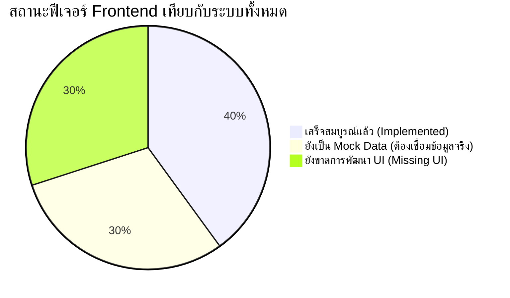
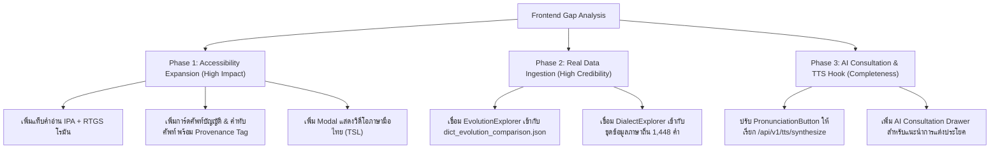

# การวิเคราะห์ช่องว่างฟีเจอร์ฝั่ง Frontend (Frontend Feature Gap Analysis)
**โครงการ:** THAI CONTEXT — Dictionary Reimagined Hackathon  
**เป้าหมาย:** สรุปฟีเจอร์ที่พัฒนาแล้ว, ฟีเจอร์ที่ยังขาด, และแนวทางการเชื่อมต่อกับ Backend API และชุดข้อมูลจริง (`data/processed/`)

---

## 1. ภาพรวมสถานะความพร้อม (Executive Summary)

| หมวดหมู่ฟีเจอร์ | สถานะ Frontend | สถานะ Backend / Dataset | สิ่งที่ต้องทำต่อ |
| :--- | :---: | :---: | :--- |
| **1. ค้นหาความหมาย (Meaning Search)** | ✅ ใช้งานได้ | ✅ API พร้อมรองรับ | เชื่อมต่อ Live API แทน Local Mock |
| **2. เปรียบเทียบคำ (Context Comparator)** | ✅ ใช้งานได้ | ✅ API พร้อมรองรับ | แสดงความต่างด้านน้ำหนักบริบท |
| **3. ตรวจสอบหลักฐาน (Evidence Drawer)** | ✅ ใช้งานได้ | ✅ ข้อมูล 3 เล่มพร้อม | แสดงหนังสือปี 2542, 2554, 2569 |
| **4. การเข้าถึง & หลายภาษา (Accessibility)** | ❌ ยังไม่มี UI | ✅ API พร้อมสมบูรณ์ | เพิ่มแท็บภาษามือ, IPA/RTGS, ศัพท์บัญญัติ |
| **5. วิวัฒนาการคำศัพท์ (Evolution Explorer)** | ⚠️ เป็น Mock | ✅ ข้อมูล 8,331 คำพร้อม | เปลี่ยนจาก Hardcoded เป็นข้อมูลจริง |
| **6. ภาษาถิ่น 4 ภาค (Dialect Explorer)** | ⚠️ เป็น Mock | ✅ ข้อมูล 1,448 คำพร้อม | เปลี่ยนจากคำว่า "คิดถึง" เป็นคลังคำจริง |
| **7. ผู้ช่วยแต่งประโยค (AI Writing Drawer)** | ❌ ยังไม่มี UI | ✅ Grounded RAG พร้อม | สร้าง Drawer สำหรับ Streaming AI advice |
| **8. ค้นหาด้วยเสียง (Voice Search)** | ❌ ยังไม่มี UI | ⚠️ Web Speech API | เพิ่มปุ่มไมโครโฟนบน Hero Search |

---

## 2. รายละเอียดฟีเจอร์ที่มีอยู่แล้ว (Implemented Features)

1. **Meaning-First Search Experience ([`SearchExperience.tsx`](file:///Users/mac/Desktop/workspace/thai-context/frontend/src/components/SearchExperience.tsx)):**
   - มี State Machine จัดการสถานะ `hero-idle`, `searching`, `results`, `evidence-open`
   - รองรับ Accessibility มาตรฐาน Reduced Motion
   - มีชิปคำแนะนำยอดนิยม ([`PopularSuggestions.tsx`](file:///Users/mac/Desktop/workspace/thai-context/frontend/src/components/hero/PopularSuggestions.tsx))
2. **Word Result Cards & Details ([`WordResultCard.tsx`](file:///Users/mac/Desktop/workspace/thai-context/frontend/src/components/search/WordResultCard.tsx), [`SearchResults.tsx`](file:///Users/mac/Desktop/workspace/thai-context/frontend/src/components/search/SearchResults.tsx)):**
   - แสดงหัวคำ (Headword), ชนิดคำ (POS), นิยามความหมาย, และคะแนนความเกี่ยวข้อง (%)
   - แสดงบริบทการใช้งาน (Contexts) และระดับภาษา (Registers)
3. **Context Comparator ([`ContextComparator.tsx`](file:///Users/mac/Desktop/workspace/thai-context/frontend/src/components/compare/ContextComparator.tsx)):**
   - เปรียบเทียบความหมาย จุดเน้น บริบท และจุดที่มักสับสนของคำ 2 คำคู่ขนานกัน
4. **Evidence Drawer ([`EvidenceDrawer.tsx`](file:///Users/mac/Desktop/workspace/thai-context/frontend/src/components/evidence/EvidenceDrawer.tsx)):**
   - แสดงที่มาของคำจากพจนานุกรมเล่มจริง (ชื่อเล่ม, ปีพิมพ์, เลขหน้า, ข้อความอ้างอิง) พร้อมป้ายรับรอง `Official Verified`

---

## 3. รายละเอียดฟีเจอร์ที่ยัง "ขาด" หรือ "เป็น Mock" (Gap Details)

### 🔴 หมวดที่ 1: Language Accessibility & Multilingual (สำคัญสูงสุดต่อโจทย์การแข่งขัน)
> [!IMPORTANT]
> Backend ได้เตรียม Database, PyThaiNLP Phonetics, Grounded RAG และ Synthetic TTS ไว้ 100% แล้ว แต่ฝั่ง Frontend ยังไม่ได้เชื่อมต่อ Endpoint เหล่านี้

1. **ภาษามือไทย (Thai Sign Language - TSL):**
   - **สิ่งที่ขาด:** หน้าต่างหรือกล่องแสดงวิดีโอ/ภาพเคลื่อนไหวภาษามือไทยสำหรับผู้บกพร่องทางการได้ยิน
   - **Backend API:** `GET /api/v1/dictionary/words/:word/sign-language`
   - **สิ่งที่ต้องเพิ่มใน Frontend:** เพิ่มแท็บหรือปุ่ม `[ภาษามือไทย 🤟]` ในหน้ารายละเอียดคำ เพื่อเปิด Modal/Drawer แสดงวิดีโอท่ามือและคำอธิบาย
2. **คำแปลภาษาอังกฤษ & ศัพท์บัญญัติ / คำjทับศัพท์ (Bilingual & Coined Terms):**
   - **สิ่งที่ขาด:** 
     - ยังไม่แสดงคำแปลภาษาอังกฤษบนการ์ดผลลัพธ์
     - ยังไม่แสดงข้อมูลคำทับศัพท์ทางการ (2,256 คำ) และศัพท์บัญญัติเฉพาะทาง (5,606 คำ) จากราชบัณฑิตยสภา
     - ขาด Provenance Badges แยกประเภทความน่าเชื่อถือ:
       - 🏛️ `OFFICIAL_ROYAL_TRANSLITERATION` (คำทับศัพท์ทางการ)
       - 📜 `OFFICIAL_ROYAL_COINED` (ศัพท์บัญญัติราชบัณฑิต)
       - 🤖 `AI_GENERATED` (AI แนะนำ)
   - **Backend API:** `GET /api/v1/dictionary/words/:word/translations`
3. **การออกเสียงสัทอักษรสากลและการถอดอักษรโรมัน (Phonetics, IPA & RTGS):**
   - **สิ่งที่ขาด:** ปัจจุบันแสดงแค่ข้อความคำอ่านไทยสั้นๆ ยังขาด:
     - สัทอักษรสากล (IPA) เช่น `/kʰit˦˥.tʰɯŋ˩˩˦/`
     - ระบบถอดอักษรโรมันฉบับราชบัณฑิต (RTGS) เช่น `khit thueng`
     - รูปแบบเสียงวรรณยุกต์ (Tone Pattern)
   - **Backend API:** `GET /api/v1/dictionary/words/:word/pronunciation`
4. **ระบบเสียงอ่านสังเคราะห์จากเซิร์ฟเวอร์ (Zero-Crash TTS Engine):**
   - **สิ่งที่ขาด:** [`PronunciationButton.tsx`](file:///Users/mac/Desktop/workspace/thai-context/frontend/src/components/pronunciation/PronunciationButton.tsx) ปัจจุบันพึ่งพา `window.speechSynthesis` ของเบราว์เซอร์ ซึ่งในอุปกรณ์มือถือหลายรุ่นไม่มีเสียงภาษาไทย หรือเสียงวรรณยุกต์เพี้ยน
   - **Backend API:** `POST /api/v1/tts/synthesize` (ส่ง Audio Stream / Cache WAV คุณภาพสูง)

---

### 🟡 หมวดที่ 2: Real Data Binding (เปลี่ยนจาก Hardcoded เป็นข้อมูลจริง)

1. **วิวัฒนาการคำศัพท์ตามยุคสมัย (Evolution Explorer):**
   - **สถานะปัจจุบัน:** [`EvolutionExplorer.tsx`](file:///Users/mac/Desktop/workspace/thai-context/frontend/src/components/evolution/EvolutionExplorer.tsx) มี UI แท็บปี 2542, 2554, 2569 แล้ว แต่ใช้ Mock Data จาก [`explorer-data.ts`](file:///Users/mac/Desktop/workspace/thai-context/frontend/src/lib/explorer-data.ts)
   - **สิ่งที่ขาด:**
     - ไม่ได้ดึงข้อมูลจริงของคำที่กำลังค้นหา
     - ยังไม่ได้เชื่อมต่อชุดข้อมูลเปรียบเทียบคำศัพท์ 3 ฉบับ (8,331 คำ) ใน `data/processed/dict/dict_evolution_comparison.json`
     - ขาดการแสดงผล Diff เชิงความหมาย (เช่น คำที่เพิ่มใหม่ในฉบับ 2569 หรือคำที่เปลี่ยนนิยาม)
2. **คลังคำภาษาถิ่น 4 ภาค (Dialect Explorer):**
   - **สถานะปัจจุบัน:** [`DialectExplorer.tsx`](file:///Users/mac/Desktop/workspace/thai-context/frontend/src/components/dialect/DialectExplorer.tsx) แสดงผลการ์ด 4 ใบที่ Hardcode คำว่า "คิดถึง" ไว้เพียงคำเดียว
   - **สิ่งที่ขาด:**
     - ยังไม่ได้เชื่อมต่อชุดข้อมูลจริง 1,448 รายการ ใน `data/processed/dialect/` (หมวดร่างกาย, หมวดเครือญาติ ฯลฯ)
     - ยังไม่มีตัวเลือกสลับหมวดหมู่คำ หรือค้นหาคำภาษาถิ่นที่ตรงกับความหมายที่ค้นหา

---

### 🔵 หมวดที่ 3: ผู้ช่วยเขียนและให้คำปรึกษาการใช้คำ (AI Writing Assistant)
*(ตรงกับข้อกำหนด FR-15, FR-16, FR-17 ใน Product Requirements)*

1. **Grounded AI Consultation Drawer:**
   - **สิ่งที่ขาด:** ช่องทางให้ผู้ใช้พิมพ์ข้อความปรึกษา เช่น *"คำนี้ใช้ในรายงานวิชาการได้ไหม"* หรือ *"ช่วยเรียบเรียงประโยคโดยใช้คำนี้ให้สุภาพ"*
   - **สิ่งที่ขาด:** ตัวรับผลลัพธ์แบบ Server-Sent Events (SSE Streaming) จาก FastAPI AI Service
2. **Hallucination Alert & Confidence Gauge:**
   - **สิ่งที่ขาด:** เกจแสดงระดับความเชื่อมั่นของ AI (Confidence Score) และป้ายแจ้งเตือนเมื่อ AI ปฏิเสธการตอบ (Abstention Guard) ในกรณีที่ไม่มีหลักฐานในพจนานุกรมรองรับ

---

### ⚪ หมวดที่ 4: ฟังก์ชันการโต้ตอบเสริม (Interactive & Usability)

1. **การค้นหาด้วยเสียง (Speech-to-Text):**
   - **สิ่งที่ขาด:** ปุ่มไมโครโฟนบนช่องค้นหา [`HeroSearch.tsx`](file:///Users/mac/Desktop/workspace/thai-context/frontend/src/components/hero/HeroSearch.tsx) เพื่อให้ผู้ใช้พูดประโยคความหมายแทนการพิมพ์
2. **ตัวกรองระดับภาษา / บริบท (Smart Filters):**
   - **สิ่งที่ขาด:** ใน [`SmartFilters.tsx`](file:///Users/mac/Desktop/workspace/thai-context/frontend/src/components/search/SmartFilters.tsx) ยังเป็นเพียง UI สแตติก ยังไม่ได้ต่อ Filter Logic เข้ากับรายการผลการค้นหา
3. **ระบบให้คะแนนผลลัพธ์ (User Feedback Loop - FR-18):**
   - **สิ่งที่ขาด:** ปุ่มกดถูกใจ/ไม่ถูกใจ (👍 / 👎) ที่การ์ดคำศัพท์ เพื่อยิงผลกลับไปยัง `POST /api/v1/feedback`

---

## 4. แผนปฏิบัติการแนะนำ (Actionable Implementation Plan)

---
*จัดทำขึ้นเพื่อให้ทีมงานและ Technical Lead ใช้เป็น Checklist ก่อนการแข่งขันรอบ Pitching & Live Demo*
