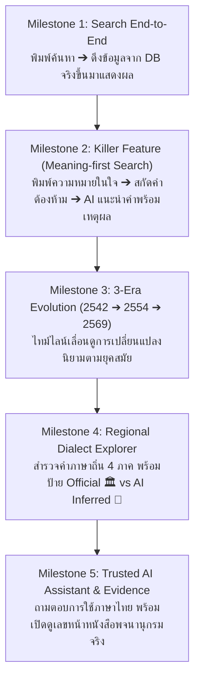

# 🧭 THAI CONTEXT — Team Prompt & Integration Hub
> **คู่มือและชุด Prompt สำหรับการพัฒนาแบบขนาน (Parallel Vertical-Slice Development) สำหรับทีม 3 คน**

---

## 👥 โครงสร้างทีมและการแบ่งไฟล์ Prompt ตาม Role

| ไฟล์ Prompt | เจ้าของบทบาท | ขอบเขตหน้าที่หลัก |
| :--- | :--- | :--- |
| [**`role-1-ai-search.md`**](./role-1-ai-search.md) | **คนที่ 1: AI & Search Engineer** | Query Understanding, Embeddings, Hybrid Retrieval (RRF), Grounded RAG, Anti-Hallucination Guardrail, Evidence Linker |
| [**`role-2-backend-devops.md`**](./role-2-backend-devops.md) | **คนที่ 2: Backend, Data & DevOps** | PostgreSQL 16 + pgvector, Multi-version Dataset (2542/2554/2569), Dialect Mapping, REST APIs, Docker, Data Governance |
| [**`role-3-frontend-product.md`**](./role-3-frontend-product.md) | **คนที่ 3: Frontend & UX/Product** | Next.js 14 App Router, Tailwind CSS, 5 UI Modules, Mock Data Toggle, 10-Step Demo Flow, Product Ownership & Pitch |

---

## 🚀 ลำดับการพัฒนาตาม Vertical Slice (Milestone 1 ➔ 5)

เพื่อไม่ให้เกิดปัญหา "ต่างคนต่างทำแล้วรวมกันไม่ติดในวันสุดท้าย" ให้ทั้ง 3 คนพัฒนาฟีเจอร์ตาม Slice เดียวกันในแต่ละรอบ:



---

## 📡 สัญญา API กลาง (Shared Integration Contract)

ใช้โครงสร้าง JSON นี้เป็นข้อตกลงร่วมกันระหว่าง Frontend (คนที่ 3), Backend (คนที่ 2), และ AI Pipeline (คนที่ 1):

### 1. Meaning-first Search (`POST /api/v1/search/meaning`)
```json
// Request Body
{
  "query": "อยากบอกว่าคนนี้ทำงานได้ดี ใช้ทรัพยากรน้อย แต่ไม่อยากใช้คำว่าเก่ง",
  "filters": {
    "register": "formal",
    "edition_year": 2554
  }
}

// Response Body
{
  "success": true,
  "data": {
    "query_understanding": {
      "detected_meaning": "ทำงานได้ผลลัพธ์ดีโดยใช้ทรัพยากรอย่างคุ้มค่า",
      "context": "การปฏิบัติงานในองค์กร",
      "excluded_words": ["เก่ง"]
    },
    "recommendations": [
      {
        "headword": "สัมฤทธิผล",
        "score": 0.94,
        "pos": "น.",
        "definition": "ผลที่สำเร็จตามความประสงค์",
        "edition_name": "พจนานุกรม ฉบับราชบัณฑิตยสถาน พ.ศ. ๒๕๕๔",
        "ai_explanation": "คำนี้เน้นถึงผลสำเร็จของงานที่มีประสิทธิภาพ เหมาะกับบริบททางการ และไม่ใช่คำว่า 'เก่ง'",
        "evidence": {
          "source_book": "พจนานุกรม ฉบับราชบัณฑิตยสถาน พ.ศ. ๒๕๕๔",
          "page_number": 1208,
          "quote": "สัมฤทธิผล น. ผลที่สำเร็จตามความประสงค์",
          "is_official": true
        }
      }
    ],
    "guardrail": {
      "passed": true,
      "confidence_score": 0.94,
      "abstention_triggered": false
    }
  }
}
```

### 2. Safe Abstention Response (เมื่อไม่พบข้อมูลหรือความมั่นใจ < 0.72)
```json
{
  "success": true,
  "data": {
    "recommendations": [],
    "guardrail": {
      "passed": false,
      "confidence_score": 0.41,
      "abstention_triggered": true,
      "message": "ขออภัย ระบบไม่พบคำศัพท์ที่ตรงตามเงื่อนไขในพจนานุกรมฉบับทางการ เพื่อป้องกันข้อมูลบิดเบือนระบบจึงไม่สร้างคำตอบขึ้นมาเอง"
    }
  }
}
```
