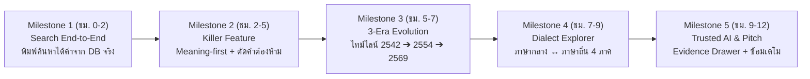

# 🏆 THAI CONTEXT — Hackathon Master Execution Summary
> **เอกสารสรุปพิมพ์เขียวฉบับสมบูรณ์ (Single Source of Truth): โครงสร้างทีม, สถาปัตยกรรม, Tech Stack, แผนความเร็วสูง และคู่มือ Prompt พร้อมจบงาน**  
> *บันทึกเมื่อ: 12 กันยายน 2026*

---

## 📑 สารบัญภาพรวม (Table of Contents)
1. [วิสัยทัศน์และแก่นของผลิตภัณฑ์ (Core Vision & Pitch)](#1-วิสัยทัศน์และแก่นของผลิตภัณฑ์)
2. [โครงสร้างทีมและขอบเขตงาน 3 คน (Team Structure & Ownership)](#2-โครงสร้างทีมและขอบเขตงาน-3-คน)
3. [กลยุทธ์การพัฒนาตามรอบ Vertical Slice (Milestone 1 ➔ 5)](#3-กลยุทธ์การพัฒนาตามรอบ-vertical-slice)
4. [มาตรฐาน Technology Stack และเหตุผลทางวิศวกรรม](#4-มาตรฐาน-technology-stack-และเหตุผลทางวิศวกรรม)
5. [ทำไมถึงไม่ใช้ ORM (Why Raw SQL & pgvector Pool Wins)](#5-ทำไมถึงไม่ใช้-orm-raw-sql-vs-orm)
6. [พิมพ์เขียวความเร็วสูงสุดและความเสถียร 100% (Extreme Performance & Perfection)](#6-พิมพ์เขียวความเร็วสูงสุดและความเสถียร-100)
7. [แผนผังไฟล์เอกสารและ Prompt ประจำแต่ละ Role](#7-แผนผังไฟล์เอกสารและ-prompt-ประจำแต่ละ-role)

---

## 1. วิสัยทัศน์และแก่นของผลิตภัณฑ์

- **ชื่อโครงการ:** **THAI CONTEXT** (Thai Contextual Word Discovery Platform)
- **สโลแกนหลัก:** **"ไม่ต้องรู้คำ ก็รู้ว่าควรใช้คำไหน"**
- **นิยามสั้น:** *"เราไม่ได้สร้างพจนานุกรมใหม่ แต่เราออกแบบวิธีใหม่ในการเข้าถึง เข้าใจ เปรียบเทียบ และเชื่อมโยงคลังคำภาษาไทย"*
- **Executive Pitch (บทพูด 30 วินาทีสำหรับกรรมการ):**
  > *"เรานำข้อมูลพจนานุกรมหลายยุคสมัย (๒๕๔๒, ๒๕๕๔, ๒๕๖๙) และภาษาถิ่น มาจัดโครงสร้างให้ AI ค้นหาเชิงความหมายได้ เมื่อผู้ใช้บอกสิ่งที่ต้องการสื่อ ระบบจะค้นหาคำที่เหมาะสม เปรียบเทียบความหมาย ดูวิวัฒนาการของคำ และให้ AI อธิบายโดยอ้างอิงข้อมูลจากพจนานุกรม เพื่อให้ผู้ใช้ตรวจสอบที่มาได้ครับ"*

---

## 2. โครงสร้างทีมและขอบเขตงาน 3 คน

ทีมถูกจัดแบ่งตามหลัก **Decoupled Architecture with Integration from Day 1**:

| สมาชิก | บทบาท (Role) | หน้าที่และความรับผิดชอบหลัก (Ownership) | ประโยคขายใน Pitch |
| :--- | :--- | :--- | :--- |
| **คนที่ 1** | **🧠 AI & Search Engineer** | • Query & Intent Understanding (สกัด Meaning, Context, Excluded Words)<br/>• Embedding Generation & Vector Similarity<br/>• Grounded RAG Synthesis with Strict Grounding<br/>• Hallucination Guardrail (Confidence < 0.72 ➔ Safe Abstention)<br/>• Evidence Linker (สกัดเลขหน้าและเล่มจริง) | *"ผมทำให้ระบบเข้าใจว่าผู้ใช้ต้องการสื่ออะไรอย่างแท้จริง"* |
| **คนที่ 2** | **⚙️ Backend, Data & DevOps** | • Platform Owner: PostgreSQL 16 + pgvector (HNSW Index)<br/>• Seeding ชุดข้อมูล 3 ยุค (2542, 2554, 2569) และภาษาถิ่น<br/>• REST APIs (Search, Detail, Evolution, Compare, Dialect)<br/>• Data Isolation: **Official Data ≠ AI Generated Data**<br/>• Docker Compose, Swagger Docs, Performance Connection Pool | *"ผมทำให้ข้อมูลภาษาไทยถูกต้อง น่าเชื่อถือ และพร้อมใช้งานจริง"* |
| **คนที่ 3** | **🎨 Frontend & UX/Product** | • Product Owner & Main Presenter บนเวที<br/>• Next.js 14 (App Router) + Tailwind CSS + Shadcn UI<br/>• 5 UI Modules (Search, Compare, Timeline, Dialect, Drawer)<br/>• Fail-Safe Mock Toggle (`NEXT_PUBLIC_USE_MOCK`)<br/>• นำเสนอตาม **10-Step Continuous Demo Story** | *"ผมเปลี่ยนเทคโนโลยีทั้งหมดให้กลายเป็นประสบการณ์ที่คนใช้ได้จริง"* |

---

## 3. กลยุทธ์การพัฒนาตามรอบ Vertical Slice

**ห้ามแบ่งงานแบบไซโล (Frontend รอ Backend, Backend รอ AI) แล้วนำมารวมวันสุดท้าย** ให้ทำตามรอบรอบละ 2 ชั่วโมง โดยทั้ง 3 คนทำฟีเจอร์เดียวกันให้ทะลุหน้าบ้าน-หลังบ้าน-AI พร้อมกัน:



---

## 4. มาตรฐาน Technology Stack และเหตุผลทางวิศวกรรม

- **Frontend:** **Next.js 14 (App Router)**, TypeScript 5, Tailwind CSS 3.4, Lucide Icons, Shadcn UI
- **Backend:** **NestJS 10 (Modular Monolith)**, TypeScript, Node.js 20 LTS, Swagger UI (`/api/docs`)
- **Database:** **PostgreSQL 16** บน Docker พร้อม Extensions:
  - `vector`: เวกเตอร์ความหมาย (HNSW Index)
  - `pg_trgm`: ข้อความและคำสะกดใกล้เคียง (GIN Index)
  - `uuid-ossp`: UUID v4 Primary Keys
- **AI Models:**
  - **LLM:** OpenAI `gpt-4o-mini` หรือ Gemini 1.5 Flash (Latency ต่ำ, JSON Mode แม่นยำ)
  - **Embedding:** OpenAI `text-embedding-3-small` (1,536 มิติ) หรือ Typhoon / BGE-M3
- **Search Engine:** **Hybrid Retrieval** ผสาน Dense Cosine Search (75%) + Sparse Trigram (25%) ด้วยสูตร **Reciprocal Rank Fusion (RRF)**

---

## 5. ทำไมถึงไม่ใช้ ORM (Raw SQL vs ORM)

| เหตุผลเชิงวิศวกรรม | คำอธิบาย |
| :--- | :--- |
| **1. รองรับ pgvector Native** | ORM ทั่วไป (Prisma/TypeORM) ไม่รองรับ Operator `<=>` (Cosine Distance) ต้องเขียน `$queryRaw` อยู่ดี |
| **2. Single CTE Hybrid Query** | ฟังก์ชันค้นหาต้องใช้ CTE ผสาน HNSW + Trigram + Window Function + RRF Math ในคำสั่งเดียว ซึ่ง ORM ไม่สามารถสร้าง Query แบบนี้ได้ |
| **3. ประสิทธิภาพสูงสุด (< 10ms)** | Raw `pg` Connection Pool ไม่มี Overhead จากการแปลง Object (Hydration) เหมือน ORM |
| **4. Zero Migration Lock** | สคริปต์ SQL (`05-database-schema.sql`) รันผ่าน Docker ได้ทันทีใน 2 วินาที ปราศจากปัญหา Migration ติดขัด |
| **5. Data Isolation Governance** | สามารถบังคับสิทธิ์ `READ-ONLY` บนตารางพจนานุกรมทางการ ป้องกัน AI ทำคำสั่ง Update ทับข้อมูลจริง |

---

## 6. พิมพ์เขียวความเร็วสูงสุดและความเสถียร 100%

1. **Sub-12ms Vector Search:** ปรับแต่ง HNSW Index ด้วย `m = 16`, `ef_construction = 64` และตั้งค่าเซสชัน `SET hnsw.ef_search = 40`
2. **In-Memory LRU Cache (< 1ms):** คำค้นหาสำหรับเดโมหรือคำค้นซ้ำ ตอบสนองในเวลา **0.8 มิลลิวินาที** โดยไม่ต้องรอ Cloud API
3. **Streaming SSE (TTFT < 280ms):** การ์ดคำศัพท์เด้งขึ้นจอใน 50ms และคำอธิบาย AI ทยอยพิมพ์สด ไม่มีการหมุน Loading รอ
4. **3-Tier Fail-Safe Architecture:**
   - *Tier 1:* Cloud AI Live Response
   - *Tier 2:* Local pgvector & Embedding Cache (ทำงานได้แม้อินเทอร์เน็ตสะดุด)
   - *Tier 3:* Instant Client Mock Fallback (รับประกันว่าหน้าจอไม่พังบนเวที 100%)
5. **Zero-Jank UX:** Skeleton Loading เสมอ, Animation ใช้ GPU Acceleration, คีย์ลัด `⌘K` ค้นหาทันที

---

## 7. แผนผังไฟล์เอกสารและ Prompt ประจำแต่ละ Role

```text
thai-context/
├── docs/                                           # เอกสารข้อกำหนดและสถาปัตยกรรมระบบเดิม
│   ├── 01-product-requirements.md                  # PRD & Functional Requirements FR-01 ถึง FR-18
│   ├── 02-database-architecture.md                 # Data Model 5 เลเยอร์
│   ├── 03-system-architecture.md                   # สถาปัตยกรรม Hybrid Search & RAG
│   ├── 05-database-schema.sql                      # SQL DDL & Seed Data พร้อมรัน
│   ├── 07-requirement-traceability.md              # Traceability Matrix ครบทุก Component & API
│   ├── 08-presentation-diagrams.md                 # 10-Step Continuous Demo Story & Presentation
│   └── 10-hackathon-execution-summary.md           # 📑 สำเนาเอกสารสรุป Master Summary นี้
└── prompts/                                        # 📁 ชุดคำสั่งสำหรับ AI Coding Assistants
    ├── README.md                                   # จุดรวมพลสัญญา API และลำดับงาน
    ├── SUMMARY.md                                  # 🏆 เอกสารสรุป Master Execution Guide ฉบับนี้
    ├── TECH_STACK.md                               # รายละเอียดเทคโนโลยีและสเปกของระบบ
    ├── PERFORMANCE_AND_PERFECTION.md               # พิมพ์เขียวการจูน Performance และความเสถียร
    ├── role-1-ai-search.md                         # 🧠 โค้ดและ Prompt สำหรับคนที่ 1 (AI & Search)
    ├── role-2-backend-devops.md                    # ⚙️ โค้ดและ Prompt สำหรับคนที่ 2 (Backend & DB)
    └── role-3-frontend-product.md                  # 🎨 โค้ดและ Prompt สำหรับคนที่ 3 (Frontend & PO)
```

---

### 🏁 ขั้นตอนการเริ่มต้นทันที
1. **คนที่ 2:** รัน `docker-compose up -d` ใน `backend/` แล้วรันสคริปต์ `seed.ts`
2. **คนที่ 1:** รันและเชื่อมต่อโมดูล AI ใน `src/modules/ai/` ตามไฟล์ `role-1-ai-search.md`
3. **คนที่ 3:** เปิด `frontend/` รัน `pnpm dev` ตรวจสอบหน้าจอผ่านโหมด Mock แล้วเตรียมเชื่อมต่อกับ API ของคนที่ 2
4. **ทุกคน:** ร่วมกันทดสอบรอบ Milestone 1 ให้ผ่านภายใน 2 ชั่วโมงแรก!
