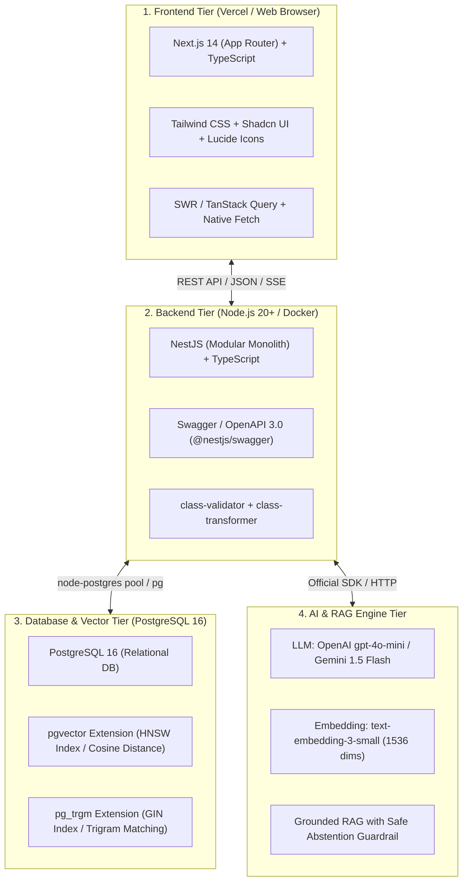

# 🛠️ THAI CONTEXT — Official Technology Stack Specification
> **มาตรฐาน Tech Stack ที่ผ่านการคัดเลือกเพื่อความเร็ว ความเสถียร และความพร้อมในการเดโมระดับ Hackathon (Zero-Conflict & High-Velocity)**

---

## 🏗️ ภาพรวมสถาปัตยกรรม (Full-Stack Architecture)

---

## 📋 รายละเอียด Tech Stack แยกตามเลเยอร์

### 1. 🎨 Frontend Tier (คนที่ 3 รับผิดชอบ)
| เครื่องมือ / เทคโนโลยี | เวอร์ชัน / รายละเอียด | เหตุผลที่เลือกใช้ใน Hackathon |
| :--- | :--- | :--- |
| **Framework** | **Next.js 14 (App Router)** | SSR/CSR รวดเร็ว, SEO พร้อม, รองรับ React Server Components |
| **Language** | **TypeScript 5.x** | Type Safety ป้องกัน Runtime Error ระหว่างการพรีเซนต์ |
| **Styling** | **Tailwind CSS 3.4** | เขียนสไตล์ได้เร็ว ไม่ต้องสลับไฟล์ CSS มี Class Utility ครบ |
| **UI Components** | **Shadcn UI + Radix UI** | คอมโพเนนต์สำเร็จรูปคุณภาพสูง สไตล์สุภาพ น่าเชื่อถือ ปรับแต่งง่าย |
| **Icons** | **Lucide React** | ไอคอน SVG สากล น้ำหนักเบา มีไอคอนหนังสือ/โล่/AI ครบ |
| **Font** | **Prompt & Sarabun (Google Fonts)** | ตัวอักษรภาษาไทยอ่านง่าย เป็นทางการ เหมาะกับงานพจนานุกรม |
| **Data Fetching** | **Native Fetch + SWR** | รองรับ Caching และระบบ Fallback ไปหา Mock Data แบบเรียลไทม์ |

---

### 2. ⚙️ Backend Tier (คนที่ 2 รับผิดชอบ)
| เครื่องมือ / เทคโนโลยี | เวอร์ชัน / รายละเอียด | เหตุผลที่เลือกใช้ใน Hackathon |
| :--- | :--- | :--- |
| **Runtime** | **Node.js 20 LTS** | เสถียรที่สุด มีประสิทธิภาพสูง และรัน TypeScript ได้อย่างราบรื่น |
| **Framework** | **NestJS 10** | สถาปัตยกรรม Modular ชัดเจน แบ่ง Controller/Service เป็นสัดส่วน |
| **Language** | **TypeScript 5.x** | สัญญาณ Interface ชัดเจน ตรงกับ Frontend ทันที |
| **DB Driver** | **`pg` (node-postgres)** | เร็วที่สุด และรองรับ Raw SQL กับ extension pgvector โดยตรงไม่ติดขัด ORM |
| **API Protocol** | **RESTful API + JSON** | เชื่อมต่อง่าย ไม่ซับซ้อน ดีบักผ่าน Browser และ Postman ได้ทันที |
| **Documentation** | **Swagger / OpenAPI 3.0** | สร้างหน้าทดสอบ API อัตโนมัติที่ `/api/docs` เพื่อให้ทีมทดลองยิง API ได้ |
| **Validation** | **class-validator** | ดักจับข้อมูลที่ไม่ถูกต้องตั้งแต่ Request วิ่งเข้า Controller |

---

### 3. 🗄️ Database & Vector Search Tier (คนที่ 2 ดูแลร่วมกับคนที่ 1)
| เครื่องมือ / เทคโนโลยี | เวอร์ชัน / รายละเอียด | ประสิทธิภาพ & ฟังก์ชันหลัก |
| :--- | :--- | :--- |
| **DBMS** | **PostgreSQL 16** | ฐานข้อมูลมาตรฐานโลก จัดการ Relational Schema 5 เลเยอร์ได้ยอดเยี่ยม |
| **Vector Engine** | **`pgvector` (0.6+)** | รองรับ Vector Embeddings ในตัว ไม่ต้องตั้งค่า Vector DB แยกตัวใหม่ |
| **Vector Index** | **HNSW (Hierarchical Navigable Small World)** | ค้นหาแบบ Cosine Distance (`<=>`) รวดเร็ว < 15ms |
| **Text Search** | **`pg_trgm` (Trigram Similarity)** | ค้นหาคำสะกด ค้นหาคำตกหล่น และ Autocomplete แบบไม่จำกัดคีย์เวิร์ด |
| **Identifier** | **`uuid-ossp` (UUID v4)** | Primary Key ที่ไม่ชนกัน และปลอดภัยต่อการอ้างอิงข้ามระบบ |

---

### 4. 🧠 AI, RAG & NLP Tier (คนที่ 1 รับผิดชอบ)
| องค์ประกอบ | เทคโนโลยี / โมเดลที่กำหนด | หน้าที่และพารามิเตอร์ |
| :--- | :--- | :--- |
| **Embedding Model** | **OpenAI `text-embedding-3-small`** (หรือ Typhoon / BGE-M3) | 1,536 มิติ, รองรับข้อความภาษาไทยได้ดี, ราคาประหยัด, แม่นยำสูง |
| **LLM (Generation)** | **OpenAI `gpt-4o-mini`** (หรือ Gemini 1.5 Flash) | ความเร็วสูงมาก (Latency ต่ำ), สังเคราะห์คำอธิบายตรงตามบริบท |
| **Parsing Engine** | **JSON Mode / Structured Outputs** | สกัด `meaning`, `context`, และ `excluded_words` ไม่หลุด Schema |
| **Retrieval Strategy** | **Hybrid RRF (Dense + Sparse)** | ผสาน Cosine Match (น้ำหนัก 0.7) + Trigram Match (น้ำหนัก 0.3) |
| **Guardrail** | **Confidence Gate (< 0.72) ➔ Safe Abstention** | ตรวจสอบความถูกต้อง หากไม่พบคำจริง จะปฏิเสธการตอบทันที |

---

### 5. 🐳 DevOps, Environment & Tools
| ส่วนงาน | เครื่องมือ | การนำไปใช้งาน |
| :--- | :--- | :--- |
| **Containerization** | **Docker & Docker Compose** | รัน PostgreSQL 16 + pgvector ด้วยคำสั่ง `docker-compose up -d` |
| **Package Manager** | **npm** หรือ **pnpm** | จัดการ Dependencies ในโฟลเดอร์ `backend/` และ `frontend/` |
| **Environment Config** | **`.env` / `.env.local`** | จัดเก็บ API Keys, Database Connection Strings อย่างปลอดภัย |
| **Version Control** | **Git & GitHub** | แตก Branch ตาม Feature และรวมเข้า `main` ตาม Vertical Slice |

---

## 🎯 เหตุผลที่ Tech Stack ชุดนี้เหมาะที่สุดสำหรับ Hackathon

1. **All-TypeScript Synergy:** ใช้ TypeScript ตลอดทั้ง Frontend (Next.js) และ Backend (NestJS) ทำให้ใช้ Type Definitions และ JSON Contracts ร่วมกันได้ 100%
2. **All-in-One Database:** การใช้ **PostgreSQL 16 + pgvector** ตัวเดียวจบทั้งตารางปกติ (Relational), ค้นหาข้อความ (Trigram), และค้นหาเวกเตอร์ (HNSW) ทำให้ทีมไม่ต้องเสียเวลาคอนฟิก Qdrant / Pinecone / Milvus หรือ Elasticsearch แยกอีกระบบ
3. **Fail-Safe Ready:** ฝั่ง Frontend มี Next.js + Mock Switcher ในตัว รับประกันว่าการพรีเซนต์บนเวทีจะไม่ล่มแม้เน็ตสถานที่จัดงานจะช้าหรือเซิร์ฟเวอร์ Backend มีปัญหา
4. **ความน่าเชื่อถือต่อหน้ากรรมการ:** กรรมการสายเทคนิคจะชื่นชอบที่มีทั้ง RRF Hybrid Search, HNSW Indexing, Swagger Docs และการแยกสิทธิ์ Official vs AI อย่างชัดเจนในระดับ Architecture ครับ
